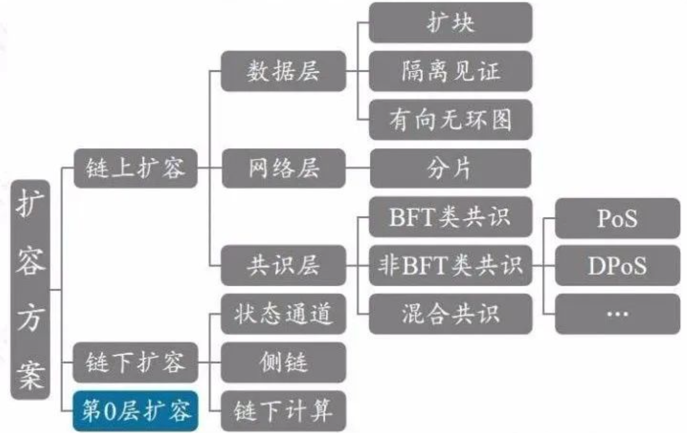

<!-- TOC -->

<h1>区块链开发学习指南</h1>

- [区块链的知识面分类](#区块链的知识面分类)
  - [基础设施](#基础设施)
  - [服务](#服务)
  - [前端交互](#前端交互)
- [区块链的全面学习计划](#区块链的全面学习计划)
  - [以太坊生态](#以太坊生态)
  - [存储生态](#存储生态)
  - [钱包和交易所](#钱包和交易所)
  - [跨链生态](#跨链生态)
  - [比特币研究](#比特币研究)
  - [联盟链](#联盟链)
  - [挖矿和矿池](#挖矿和矿池)
- [核心技术点分析](#核心技术点分析)
  - [存储](#存储)
  - [网络](#网络)
  - [语言](#语言)
  - [共识](#共识)
  - [扩容](#扩容)
  - [密码学](#密码学)
  - [数据结构算法](#数据结构算法)
- [公司的类型](#公司的类型)
- [相关工作内容](#相关工作内容)
- [学习方法总结](#学习方法总结)

    前言：该文档的目的总结区块链要学习的全面知识点，并且和中心化的开发模式做对比，然后总结学习思路以及方向，避免学习过程中的弯路。

# 区块链的知识面分类

 概述：这个模块从区块链全面的角度来分析区块链需要学习的知识点，如果，把现有的系统开发模式划分为三个部分，也即基础设施、微服务、前端。那么现在的区块链开发也可以划分为三个模块。

## 基础设施

- 中心化开发模式：包括云原生，如kubernetes，ci/cd工具等工具链，监控微服务治理等。

  技术要点：k8s，jenkins，ELK, prometheus，分布式系统，负载均衡，服务发现，istio, Linux等等 

- 去中心化模式：在区块链开发中，也会用到中心化的运维和部署工具，比如kubernetes等。第二部分，包括底层链的开发，包括现有的公链以及侧链等等，还有扩容，预言机等技术。

  技术要点：k8s，jenkins, prometheus，分布式系统，共识机制（pow,pos,tendermint），layer2，oracle（预言机），侧链, Linux，hyperledger fabric（联盟链）等等

  基础设施模块，对于中心化的devops也需要掌握，但是，底层公链相关是重点学习的内容。

## 服务

- 微服务：微服务实现了应用的业务逻辑

  技术要点：grpc，mysql，go（Gingo, Gorm）或者java（Spring，mybatis）

- 智能合约：在区块链开发里面服务对应着智能合约，开发应用，也就是dapp，其实就包括了智能合约，智能合约用来处理应用的业务逻辑。

  技术要点：Solidity，Truffle，Remix，Ganache，EVM, WASM虚拟机，infura（节点托管服务）等等。

  智能合约是区块链开发需要重点掌握的知识。

## 前端交互

  区块链开发中的前端和现有的前端差不多，都包括了H5，Androi d，IOS等等前端交互，不同的地方是，区块链的前端，需要和区块链的节点通信，并且调用智能合约，来实现应用的需求。

   技术要点：web3j（java语言），web3js，etherjs、ABI（应用程序接口）等等

   区块链开发方向，对于前端方面，不需要特别去研究Android，IOS或者前端技术栈，而是熟悉智能合约的调用以及以太坊的json-rpc接口就可以。

# 区块链的全面学习计划

## 以太坊生态
（1）master ethereum，[精通以太坊中文版](https://github.com/inoutcode/ethereum_book)，作者Gavin Wood

  这本书可以全面了解以太坊相关的知识，对以太坊有一个整体的把握，下面是以太坊官方资料：

   [以太坊白皮书知乎](https://zhuanlan.zhihu.com/p/47917044)

   [以太坊白皮书英文](https://ethereum.org/en/whitepaper/#introduction-to-bitcoin-and-existing-concepts)

   [以太坊白皮书中文](https://gitee.com/xingzjx/blockchain/blob/master/ethereum%20whitepaper.md)

   [以太坊黄皮书中文](https://github.com/wanshan1024/ethereum_yellowpaper)

   [币安智能链白皮书](https://github.com/binance-chain/whitepaper)

   [以太坊JSON-RPC文档](https://github.com/ethereum/wiki/wiki/JSON-RPC)

（2）智能合约

  [智能合约学习教程](https://github.com/Fankouzu/smart-contract)

  [solidity官方文档](https://solidity-cn.readthedocs.io/zh/develop/)

  [truffle官方文档](https://www.trufflesuite.com/docs/truffle/overview)

（3）现有dapp设计：比如uniswap

  [uniswap开发视频教程](https://www.bilibili.com/video/av754463969/)

  [uniswap开发解读](https://github.com/a497500306/my-uniswap-v2-core)

  [uniswap白皮书v2中文](https://github.com/Blueswing/uniswap-whitepapers-cn)

（4）共识算法

（5）扩容 ：layer2

（6）网络模型：devp2p

（7）密码学知识

## 存储生态

   技术要点：cephfs，filecoin，ipfs

  [filecoin白皮书中文版](https://gitee.com/xingzjx/blockchain/blob/master/filecoin%20whitepaper%20cn.md)

  [chia白皮书](https://www.kuangjiwan.com/upload/doc/Chia-Business-Whitepaper-2021-02-09-v1.0.pdf)

  [chia绿皮书](https://www.chia.net/assets/ChiaGreenPaper.pdf)

  注意：奇亚等并不属于存储生态，只是使用了类似的时空证明或者Poc共识机制。

## 钱包和交易所
   钱包和交易所的业务有一定的重叠，钱包常见技术：闪兑原理，web3j等

   [交易系统架构演进之路](https://mp.weixin.qq.com/s?__biz=MzA5OTI1NDE0Mw==&mid=2652494063&idx=1&sn=a5aab0ef8be03de2a87377ad275d9159&chksm=8b6852ffbc1fdbe90d4b727c4510ef1ed9d3b2498f1dadb0c458c6464e8c4fc32b1957f919da&scene=21#wechat_redirect)

## 跨链生态

   技术要点：comos，rust， polkadot

  [波卡白皮书中文版](https://learnblockchain.cn/2019/05/17/polkadot-whitepaper/)

  [cosmos白皮书中文版](https://blog.csdn.net/shangsongwww/article/details/92572870)
  [cosmos白皮书英文版](https://github.com/cosmos/cosmos/blob/master/WHITEPAPER.md)

## 比特币研究

  [精通比特币中文版](https://github.com/xingzjx/MasterBitcoin2CN/blob/master/README.md)

  [比特币白皮书中文版](https://www.8btc.com/wiki/bitcoin-a-peer-to-peer-electronic-cash-system)

  [比特币白皮书中文(Bitcoin.org版)](https://bitcoin.org/files/bitcoin-paper/bitcoin_zh_cn.pdf)

## 联盟链

 技术要点：hyperledger fabric , quorum（摩根大通开源），云商（如阿里baas）

 学习视频链接: https://pan.baidu.com/s/1PwmNI99fwWVUyLTwrRazSw  密码: b3mf，该视频链接包括中心化的后台开发，以及涵盖了上面列表的大部分知识。

 ## 挖矿和矿池

 研究比特币，以太坊以及其它山寨币挖矿的过程，以及矿池搭建和原理。

 [stratum协议v2版本](https://zh.braiins.com/stratum-v2)
 [poc矿池hpool](https://www.hpool.com/)
 [btcpool开源实现](https://github.com/btccom/btcpool-ABANDONED)
 [open-ethereum-pool以太坊矿池学习笔记](https://github.com/fengchunjian/open-ethereum-pool_notes)

# 核心技术点分析

  这个模块从多个领域分析总结，找到知识点之间的公共模块。其中包括了Android，IOS，H5，后台Go，跨端等开发领域分析总结，提炼出有限的知识点和模块，进一步深化学习。

## 存储

  移动端的存储包括网络以及本地存储sqlite或者基于key-value的存储。后台开发 中常见存储技术有云盘，分布式存储系统ceph，群晖等等。

  区块链开发需要掌握的分布式存储系统ceph，以及去中心化存储filecoin,ipfs，以太坊链上存储等等。filecoin需要学习其共识算法（存储证明和时空证明）。还包括区块链账本，一般用到的技术有leveldb。

​    关键字：filecoin， ipfs ，ceph，PoRep， PoSt

## 网络

  中心化的模型，是基于客户端服务器的模式，而区块链中的网络模型则是p2p，每个节点作为客户端，也是服务端，也是去中心化的。常见的p2p开发库有，devp2p以及libp2p，目前以太坊使用的是devp2p，大部分底层公链使用的都是libp2p。目前libp2p已经成为主流的p2p网络实现，形成了开源社区，以太坊2.0也计划使用libp2p来实现其p2p网络。其中libp2p和devp2p都使用了kad算法（DHT）来实现分布式路由寻址。

​    关键字：devp2p，libp2p，dht，kad，gossip

[详解区块链P2P网络](https://learnblockchain.cn/article/292)

## 语言

  底层链以及公链开发的语言大部分是Golang，也有Rust，Java，C++等。一般，大部分公链有多种语言实现版本，比如以太坊，就有Go，Rust，Java等实现版本。

  以太坊智能合约方面的主要开发语言是Solidity，hyperledger fabric的合约（链码）开发语言支持Go，Java等。

  前端交互方面还是中心化开发模式，用到的技术栈还是一样，只不过会对接比如以太坊的sdk，比如web3j，we b3js，web3dart等等。

  关键字：Rust，Golang， Solidity，EVM，WASM，Web3j，Web3js

  参考链接：

  [solidity官方文档](https://solidity-cn.readthedocs.io/zh/)

  [go语言设计与实现](https://draveness.me/golang/)

  [Go进阶训练营](https://u.geekbang.org/subject/go?utm_source=time_web&utm_medium=menu&utm_term=timewebmenu&utm_identify=geektime&utm_content=menu&utm_campaign=timewebmenu&gk_cus_user_wechat=university)

## 共识

​     区块链中的共识机制相当与分布式系统的一致性算法，常见的分布式系统的一致性算法有Paxos，Raft，PBFT（拜占庭共识），ZAB算法等等。区块链中的场景共识机制有Pow，Pos，Tendermint（拜占庭共识），混合共识（波卡，GRANDPA 和 BABE机制），Dpos等等。

​    关键字：Paxos，Raft，Pow，Pos， Dpos， Tendermint，PBFT

[Tendermint官方文档](https://docs.tendermint.com/master)

[Tendermint官方文档中文版本](https://learnblockchain.cn/docs/tendermint/)

[以太坊之Casper协议](https://zhuanlan.zhihu.com/p/40100624)

[以太坊之Casper协议英文](https://arxiv.org/pdf/1710.09437.pdf)

[实用拜占庭容错论文中文版](https://blog.csdn.net/DeveloperRen/article/details/82771710)

[共识算法系列之一：raft和pbft算法](https://zhuanlan.zhihu.com/p/35847127)

[Raft一致性算法论文](https://github.com/maemual/raft-zh_cn)

[The Byzantine Generals Problem](https://blog.csdn.net/weixin_37887116/article/details/107655597)

[Raft共识实现](https://raft.github.io/)

[Poa共识机制](https://github.com/ethereum/EIPs/issues/225)

## 扩容

  扩容指的的是提高区块链的TPS。扩容技术可以划分为两种方式，链上扩容和和链下扩容。

其中，链下扩容layer2方案中，知名的有Optimistic Rollup和ZkRollup 

参考：

[谈谈区块链的链上扩容与链下扩容](https://zhuanlan.zhihu.com/p/136670951)

[两万字全解 Polkadot 架构及下一代 DApp 开发技术](https://www.chainnews.com/articles/346896273320.htm)

  关键字：Optimistic Rollup，ZkRollup ，layer2，Zksnark，跨链，分片，闪电网络，共识

## 密码学

​     在区块链中，应用到了大量的密码学知识，比如对称加密，非对称加密，哈希算法，椭圆曲线算法，零知识证明、随机数算法等等。比如私钥是伪随机数算法生成，而私钥推导公钥用到了椭圆曲线算法。

   关键字：椭圆曲线，对称加密，非对称加密，ssl，zksnark，签名，随机数算法，vdf（可延迟证明）

## 数据结构算法

​     区块链用到的常见的数据结构是默克尔树（一种二叉树），uniswap交易所的工厂合约用到了恒定乘积做市算法，椭圆曲线算法等等。

​    关键字：默克尔树，恒定乘积

# 公司的类型

   区块链开发的厂家公司类型包括项目外包，矿商，节点运营商，金融defi包括量化等，传统互联网公司（联盟链baas），区块链媒体，特定领域公链，数字交易所。

  其中，国内在做底层链有趣链（跨链等）OnChain(DNA链)，TopChain，唯链，公信宝，贝尔链（bitconch），conflux，维基链。

# 相关工作内容

- 底层设施方面：包括区块链节点运营部署维护等，传统微服务的开发等。

- 公链侧链方面：包括共识算法，扩容等相关内容。

- 智能合约方面：包括dapp开发和审计相关内容。
- 区块链前端方面：包括原有的Android，IOS，H5等前端技术栈。

# 学习方法总结

   学习方法方面属于个人总结及看法，先全面学习区块链的相关技术，对应第二节及其学习计划列表中列举的技术要点以及视频相关的程。这样学习一遍之后，对于区块链的开发就有了整体的认识，然后在从核心技术点出发去归纳总结之前学习的知识，每隔一段时间学习和研究一个话题，并且有相关的技术文档输出。

  这个学习思路是先面后点，从点扩展到面，相互融合。其中，面只的是知识的全面性以及整个知识体系，而点，是从知识面总结出来的关键点，并且是有限的分类。

  最后，补充一点，学习资料的收集，尽可能的来自官方以及比较权威的资料。