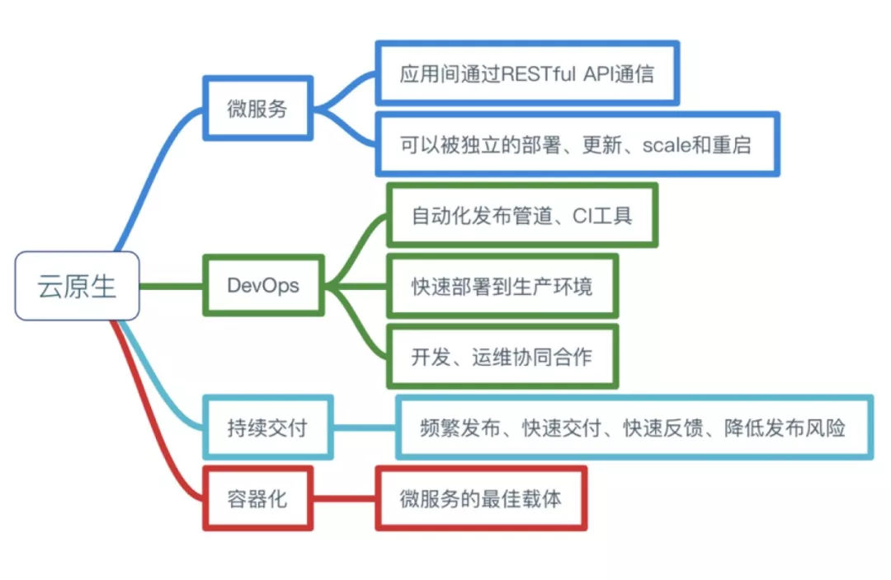

# 从云原生到区块链

- [从云原生到区块链](#从云原生到区块链)
  - [云原生四要素](#云原生四要素)
    - [微服务](#微服务)
    - [devops](#devops)
    - [持续交付](#持续交付)
    - [容器化](#容器化)
  - [云原生开源项目](#云原生开源项目)
  - [TBD 开发模式](#tbd-开发模式)
    - [TBD：基于主干的开发模式](#tbd基于主干的开发模式)
    - [Git Flow : 传统的分支管理开发模式](#git-flow--传统的分支管理开发模式)
  - [CI/CD 之 Jenkins](#cicd-之-jenkins)
    - [两个实例：](#两个实例)
    - [Jenkinsfile](#jenkinsfile)
  - [spring cloud 和 k8s](#spring-cloud-和-k8s)
  - [云原生和区块链](#云原生和区块链)
    - [联盟链场景](#联盟链场景)
    - [swarm　场景](#swarm场景)

前言：整理次笔记的目的,其一，为了后期区块链项目在云原生的实践提供架构指导，其二，大家对这套体系有一定的兴趣。就目前而言，云原生在后端开发等领域趋向成熟，但是，在区块链方向的实践基本很少，甚至没有，就个人看法，云云生这套体系不久将会在区块链项目场景中得到广泛的应用。

## 云原生核心主题



参考:

[云原生到底是什么？一文了解云原生四要素！](https://blog.csdn.net/xianshengsun/article/details/104223682)

### 微服务

分层：公共服务，功能组合服务，垂直业务服务

通信： gRPC 

服务发现与注册：kube-dns(k8s的etcd)

分布式追踪：Jaeger

日志分析：ELK(ElasticSearch, Logstash, Kibana)

服务网格：Service Mesh，比如 istio, 负载均衡、服务发现、认证授权、监控追踪、流量控制

参考：

[024.微服务架构之服务注册与发现（kubernetes / SpringCloud）](https://www.cnblogs.com/badboyh2o/p/11027378.html)
Cloud Native Computing Foundation (CNCF) serves as the vendor-neutral home for many of the fastest-growing open source projects, including Kubernetes, Prometheus, and Envoy.


### devops

- 开发和运维相互融合，紧密协作，打破传统运维不会开发的局面。

- 快速部署到生产环境

- 自动发布管道，CI/CD ，TBD 模式

总而言之，devops 已成为一个细分领域，也就是熟悉运维的开发，或者反过来。

### 持续交付

敏捷：快速集成，快速发版，快速上线, 和TBD的开发模式很切合。

### 容器化

容器化是运行服务的一种载体，目前，区块链的节点运营也可以使用容器作为载体。


## 云原生开源项目

[云原生开源汇总收集](https://github.com/rootsongjc/awesome-cloud-native)

[云原生官方图谱](https://github.com/cncf/landscape/blob/master/README.md#trail-map)

[云原生官方分类](https://landscape.cncf.io/)

[值得关注的 9 个开源云原生项目 | Linux 中国](https://zhuanlan.zhihu.com/p/134163633)

区块链底层链中用到的云原生开源项目

- bee 源码（swarm）：　docker , jaeger , opentracing , zap(uber), prometheus, grpc
- go-ethereum 源码： docker, influxdb, prometheus, grpc
- go-ipfs 源码：docker , opentracing ,  prometheus, grpc, zap(uber)
- lotus（filecoin　ｇｏ 实现）：docker , opentracing ,  prometheus, grpc, zap(uber), influxdb

## TBD 开发模式

常见开发模式

### TBD：基于主干的开发模式

- master：trunk　分支

- release: 比如　release/v1.0.0，　测试分支

- ｔag：　tag名例如，ｖ1.0.0，　tag　从 release 分支上打，表示线上。


如何避免发布引入未完成 Feature，答案是使用 Feature Toggle 。在代码库里加一个特性开关来随时打开和关闭新特性是最容易想到的也是最容易被质疑的解决方案。Feature Toggle 是有成本的，不管是在加 Toggle 时的代码设计，还是在移除 Toggle 时的人力成本和风险，都是需要和它带来的价值进行衡量的。

如何进行线上 Bug Fix，答案是在发布时打上 Release Tag，一旦发现这个版本有问题，如果此时 master 分支还没有其他提交，那可以直接在 master 分支上 Hot Fix 然后合并至 release 分支；如果 master 分支已经有了提交就需要做以下三件事：

从 Release Tag 创建发布分支。

在 master 上做 Fix Bug 提交。

将 Fix Bug 提交 Cherry Pick 到 release 分支。

为 release 分支打上新的 Tag 并做一次发布。
　
参考：

[Trunk Based Development 主干开发模型](https://www.codercto.com/a/38021.html)

### Git Flow : 传统的分支管理开发模式

传统的多分支管理方案。

[Git Flow 的正确使用姿势](https://www.jianshu.com/p/41910dc6ef29)

## CI/CD 之 Jenkins

### 两个实例：

- Android系统自动化发版本流程

开发期间： 提交代码

Jenkins: 代码检查，性能分析matrix，打包apk， 上传到服务器目录，上传到cms

系统服务器：定时合并apk和资源文件，自动打包img镜像

- 后端自动化构建流程


###　Jenkins 实践中的问题

- 使用触发器而不是轮循
- 使用 docker 构建前端，Android，iOS，后端等等。
- Android 工程构建耗资源问题：使用多节点构建。
- 构建的时候确保部署jenkins的机器网络通畅。
- 打包构建慢的问题：使用缓存，避免重复下载。

### Jenkinsfile


- flutter（Android）部署的 Jenkinsfile

```Jenkinsfile

#!/usr/bin/env groovy

pipeline {
    agent {
        docker {
            image 'xingzjx/flutterci:0.0.4'
            args '-v $HOME/.gradle:/root/.gradle'
        }
    }
    environment {
        FLAVOR = build_flavor(env.BRANCH_NAME)
    }
    stages {
        stage('Build') {
            steps {
                sh "./jenkins/build.sh ${FLAVOR}"
            }
        }
        stage('Test') {
            steps {
                sh "./gradlew test"
            }
        }
        stage('Delivery-Release') {
            when {
                anyOf {
                    branch 'release'
                }
            }
            steps {
                //sh "./jenkins/deliver.sh ${FLAVOR} ${env.BRANCH_NAME}"
                archiveArtifacts artifacts: "app/build/outputs/apk/${FLAVOR}/*.apk", fingerprint: true
            }
        }
        stage('Cleanup') {
            steps {
                sh './gradlew clean'
            }
        }
    }
    post {
        failure {
            notifyFailed()
        }
        success {
            notifySuccessed()
        }
    }
}

def build_flavor(branch_name) {
    if (branch_name ==~ /r[.0-9]+/ || branch_name == 'master') {
        return 'release'
    }
    return 'debug'
}

def notifySuccessed() {
}

def notifyFailed() {

}

```

- go 语言部署的 Jenkinsfile

```Jenkinsfile

pipeline {
  agent none
  environment {
    APP_NAME = 'xxxx'
  }
  stages {
    stage('notify-start') {
      agent { docker 'xxxx/bsdo' }
      when {
        anyOf {
          branch 'master'; branch 'release/*'; tag "release*"; tag "preview*"
        }
      }
      steps {
        script {
          sh "dingtalk link -t ${COMMON_DING_TOKEN} -i \"${APP_NAME} CI start on ${BRANCH_NAME}\" -e \"${GIT_COMMIT}\" -u \"${RUN_DISPLAY_URL}\" -p \"${COMMON_DING_PICTURE}\""
        }
      }
    }
    stage('test') {
      agent {
        docker {
          image 'xxxx/bsdo'
          args '-v /devops/ssh/id_rsa:/root/.ssh/id_rsa -v /devops/go-mod:/go/pkg/mod -u root'
        }
      }
      when {
        anyOf {
          branch 'master'; branch 'release/*'
        }
      }
      steps {
        sh "make test"
        stash includes: 'coverage.data', name: 'coverage.data'
      }
    }
    stage('sonarqube') {
      agent { label 'docker' }
      when {
        anyOf {
          branch 'master'; branch 'release/*'
        }
      }
      environment {
        scannerHome = tool 'SonarQubeScanner'
        APP_VERSION = sh(script: "cat package.json | grep version | head -1 | awk -F: '{ print \$2 }' | sed 's/[\",]//g' | tr -d '[[:space:]]'", returnStdout: true).trim()
      }
      steps {
        withSonarQubeEnv('SonarQube Server') {
          unstash 'coverage.data'
          script {
            sh "${scannerHome}/bin/sonar-scanner -Dsonar.projectKey=${APP_NAME}:key -Dsonar.projectName=${APP_NAME} -Dsonar.projectVersion=${APP_VERSION} -Dsonar.sources=. -Dsonar.exclusions=**/proto/** -Dsonar.language=go -Dsonar.tests=. -Dsonar.test.inclusions=**/*_test.go -Dsonar.test.exclusions=**/vendor/**,**/proto/** -Dsonar.go.coverage.reportPaths=coverage.data -Dsonar.coverage.dtdVerification=false"
          }
        }
      }
    }
    stage('build') {
      agent {
        docker {
          image 'xxxx/bsdo'
          args '-v /devops/ssh/id_rsa:/root/.ssh/id_rsa -v /var/run/docker.sock:/var/run/docker.sock -v /devops/docker/:/root/.docker -v /devops/go-mod:/go/pkg/mod -u root'
        }
      }
      when {
        anyOf {
          branch 'master'; branch 'release/*'
        }
      }
      post {
        always {
            sh "pwd && whoami"
            sh "make cleanup"
        }
      }
      steps {
        script {
          if (env.BRANCH_NAME == 'master') {
            sh "make build-master"
          } else {
            sh "make build-release"
          }
        }
      }
    }
    stage('deploy') {
      agent {
        docker {
          image 'xxxx/bsdo'
          args '-v /devops/kubectl:/root/.kube -u root'
        }
      }
      when {
        anyOf {
          branch 'master'; branch 'release/*'; tag "release*"; tag "preview*"
        }
      }
      steps {
        script {
          if (env.TAG_NAME != null) {
            if (env.TAG_NAME.matches("release(.*)")) {
              sh "make deploy-we-prod-preview"
              sh "dingtalk link -t ${COMMON_DING_TOKEN} -i \"${APP_NAME} ${BRANCH_NAME} 欧服确认部署\" -e \"${GIT_COMMIT}\" -u \"${RUN_DISPLAY_URL}\" -p \"${COMMON_DING_PICTURE}\""
              input "确认要部署xxxx线上环境吗？"
              sh "make deploy-we-prod"              
            }
          } else {
            if (env.BRANCH_NAME == 'master') {
              sh "make deploy-dev"
            } else {
              sh 'make deploy-we-test'
            }
          }
        }
      }
    }
    stage('notify-success') {
      agent { docker 'xxxx/bsdo' }
      when {
        anyOf {
          branch 'master'; branch 'release/*'; tag "release*"; tag "preview*"
        }
      }
      steps {
        sh "dingtalk link -t ${COMMON_DING_TOKEN} -i \"${APP_NAME} CI success on ${BRANCH_NAME}\" -e \"${GIT_COMMIT}\" -u \"${RUN_DISPLAY_URL}\" -p \"${COMMON_DING_PICTURE}\""
      }
    }
  }
  post {
    failure {
      node('docker'){
        sh "docker run xxxx/dingtalk dingtalk text -t ${COMMON_DING_TOKEN} -c \"${APP_NAME} CI failed on ${BRANCH_NAME}\" -a"
      }
    }
  }
}

```

## spring cloud 和 k8s

Spring Cloud ： 为开发人员提供了一些工具，用于快速构建分布式系统中的一些常见模式(例如配置管理、服务发现、断路器、智能路由、微代理、控制总线、一次性令牌、全局锁、领导选举、分布式会话、集群状态)。分布式系统的协调导致了样板模式，使用Spring Cloud开发人员可以快速建立实现这些模式的服务和应用程序。它们在任何分布式环境中都能很好地工作，包括开发者自己的笔记本电脑、裸金属数据中心和像Cloud Foundry这样的托管平台。

Kubernetes　：　是一个可移植的、可扩展的开源平台，用于管理容器化的工作负载和服务，可促进声明式配置和自动化。 Kubernetes 拥有一个庞大且快速增长的生态系统。Kubernetes 的服务、支持和工具广泛可用。


[k8s的服务发现](https://kubernetes.io/zh/docs/concepts/services-networking/service/)


[Kubernetes和Spring Cloud哪个部署微服务更好？](https://www.kubernetes.org.cn/1057.html)

[Spring Cloud 官方文档](https://spring.io/projects/spring-cloud)


## 云原生和区块链

### 联盟链场景

以下方案属于联盟链在云原生方面的实践。

[什么是云原生区块链？](https://my.oschina.net/CITACloud/blog/4898866)

[万向区块链“融合创新”系列讲座 | 区块链+云原生，为链插上云的翅膀](https://blog.csdn.net/WXblockchain1/article/details/108583374)

### swarm　场景

- 现有方案

　docker-compose　集群方案，这种方案无法管理集群，很多东西需要在机器上直接部署和运维，不方便管理，效率底下。

- 待选方案

　k8s 集群管理方案，目前在现有的云原生方案非常成熟，比如阿里云k8s集群，但是，在区块链方面，目前还没有特别好的实践，需要考虑的问题：
　
  多集群管理问题。

  端口和ｉｐ暴露问题,目前　nodeport　模式比较适合。


- 后期设想
  
  filecoin,ethereum等以云原生作为基础设施的架构。

