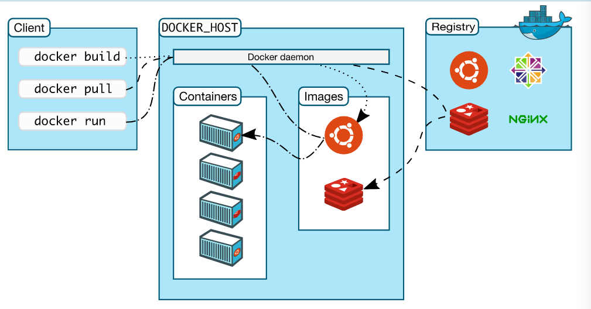

# docker 源码学习导读

## 准备工作

### 官方文档

在学习源码之前，建议先整体阅读官方文档，且有一定的　docker 使用经验

https://docs.docker.com/get-started/overview

## docker 命令文档

熟悉基本的 docker 命令：

https://docs.docker.com/engine/reference/commandline/docker

###　docker objects

docker objects 包括Images，Containers，Local daemons，Volumes，Networks，Swarm nodes，　Swarm services　等等。

- Images
 
镜像是一个只读模板。通常，一个镜像基于另一个镜像，并带有一些额外的定制。例如，您可以构建一个基于ubuntu镜像的镜像，但是安装Apache web服务器和您的应用程序，以及使您的应用程序运行所需的配置细节。

- Containers
  
容器是映像的一个可运行实例。您可以使用Docker API或CLI创建、启动、停止、移动或删除容器。您可以将容器连接到一个或多个网络，将存储附加到它，甚至根据其当前状态创建一个新镜像。

- Networks

解决容器和容器以及主机之间的网络通信问题。Networks　是一种插件化的形式，可以自定义插件扩展第三方的网络驱动。常见的网络类型有　brige，host,none　等。

- Volumes

卷是docker官方推荐的持久化方案，除了这种方式，还有　bind mounts，　tmpfs mounts 以及　name pipes 方式。

## docker 架构

### Docker Daemon

Docker守护进程(dockerd)监听Docker API请求，管理Docker对象，如镜像、容器、网络和卷。一个守护进程也可以与其他守护进程通信来管理Docker服务。

### Docker Client

Docker客户端(Docker)是许多 Docker 用户与 Docker 交互的主要方式。当您使用诸如 docker run 之类的命令时，客户端将这些命令发送给 dockerd ，由 ockerd 执行这些命令。docker命令使用docker API。Docker客户端可以与多个守护进程通信。

### Docker Registry

Docker Registry 存储 Docker 镜像。Docker Hub 是一个任何人都可以使用的公共注册表，Docker默认配置为在 Docker Hub上查找映像。您甚至可以运行自己的私有注册表。

当您使用 docker pull 或 docker run命令时，将从配置的注册表中提取所需的映像。当您使用 docker push 命令时，您的映像将被推送到已配置的注册表中。

## 源码结构

从Docker 20.10版本开始，Docker Engine和Docker CLI的包直接从它们各自的源库构建，而不是从 [docker-ce](https://github.com/docker/docker-ce) 库构建。

Docker Engine : https://github.com/moby/moby

Docker CLI : https://github.com/docker/cli

### Docker Engine

cmd 目录：dockerd 的入口，main函数

api 目录：路由，接收客户端cli命令的请求入口

### Docker CLI

cmd 目录：客户端进程入口函数

cli 目录：docker　命令入口
