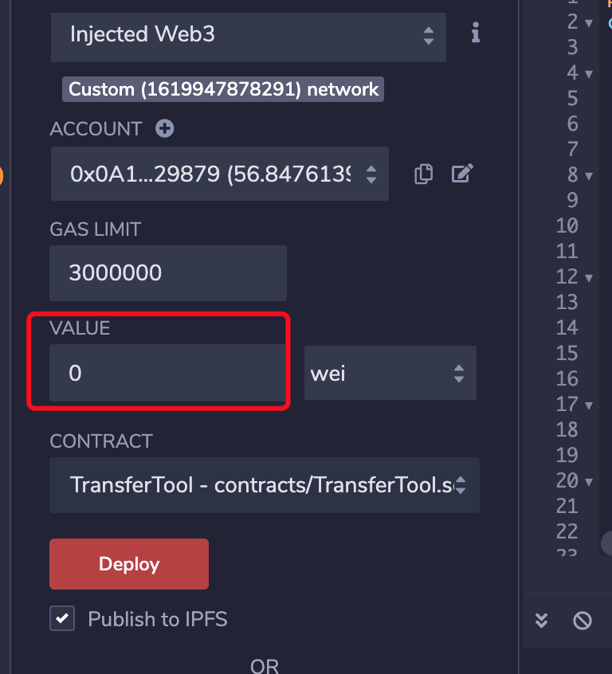

# 以太坊以及ERC20批量转账

## 批量转账方案

方案一：用webjs或者web3j接口实现批量转账，这样转账方式是一笔一笔的。

方案二：智能合约实现批量转账，这样相当于把多笔交易打包到一笔，可以节约手续费，也提高了转账的效率。

业务场景：批量转账可以用于空头或者交易所提币场景。

已实现工具参考：[https://cointool.app](https://cointool.app/)

[智能合约实现批量转账(空投)可转代币或者以太币](https://www.kanzhun.com/jiaocheng/592521.html)

[开源批量转币工具](https://multisender.app/)

## 合约实现

```javascript
pragma solidity ^0.4.24;
contract TransferTool {
         address owner = 0x0;
         //添加payable,支持在创建合约的时候，value往合约里面传eth
         function TransferTool () public  payable{
              owner = msg.sender;
         }
  
         //批量转账
         //添加payable,支持在调用方法的时候，value往合约里面传eth，注意该value最终平分发给所有账户
         function transferETHS(address[] _tos) payable public returns (bool) {
                require(_tos.length > 0);
                require(msg.sender == owner);
                var vv = this.balance/_tos.length;
                for(uint32 i=0;i<_tos.length;i++){
                   _tos[i].transfer(vv);
                }
             return true;
          }
         
         /**  添加payable,支持在调用方法的时候，value往合约里面传eth，注意该value最终平分发给所有账户
      _tos["0x4280b294500334951B6665A0B4bE4027601468f5","0x91571839E55a6a4D199cc54abcba8c047ecC4622"]
        values:[1000000000000000000,1000000000000000000]  
         **/
         function transferETHS(address[] _tos,uint256[] values) payable public returns (bool) {
                require(_tos.length > 0);
                require(msg.sender == owner);
                for(uint32 i=0;i<_tos.length;i++){
                   _tos[i].transfer(values[i]);
                }
             return true;
         }
         
         //直接转账
         function transferETH(address _to) payable public returns (bool){
                require(_to != address(0));
                require(msg.sender == owner);
                _to.transfer(msg.value);
                return true;
         }
         function chkBalance() public view returns (uint) {
             return address(this).balance;
         }
         
         /**
          * 
          * 批量转代币,
           参数说明参数说明：
          * 发送者地址，代币合约地址，接收账号[],发送代币量
          * */
        function transfer(address from,address caddress,address[] _tos,uint v)public returns (bool){
            require(_tos.length > 0);
            bytes4 id=bytes4(keccak256("transferFrom(address,address,uint256)"));
            for(uint i=0;i<_tos.length;i++){
                caddress.call(id,from,_tos[i],v);
            }
        return true;
        }
         
        //添加payable,用于直接往合约地址转eth,如使用metaMask往合约转账
        function () payable public {
        }
        
        function destroy() public {
            require(msg.sender == owner);
            selfdestruct(msg.sender);
         }
 
}
```

1.在remix执行该合约代码

2.然后进行方法测试

参数 address数组填写例子：

["0x9772ECe45485BAdB5E9CEe2Dbba558cfe7645B85","0x1EF1a3C7341453bF93bEc9b661367c7fc8Aa98e7"]

value数组填写例子：   [1000000000000000000,1000000000000000000]

## 注意事项

1.使用合约地址转账的时候，需要确保合约地址上有以太坊。否则会弹框转账失败的提醒。因为，合约中提供的方法是转出合约中的以太坊代币。

2.transferETH该方法的时候，注意填写需要发送的以太坊的value值。



3.在填写value的时候，注意单位是wei。

kwei (1000 Wei)
mwei (1000 KWei)
gwei (1000 mwei)
szabo (1000 gwei)
finney (1000 szabo)
ether (1000 finney)
简单地说就是就是1 以太币 = 1000000000000000000 Wei ，10的18次方。

3.转ERC20代币需要给合约授权额度，也就是调用ERC20代币的approve方法，填合约账户地址。

## 客户端调用

node调用。

