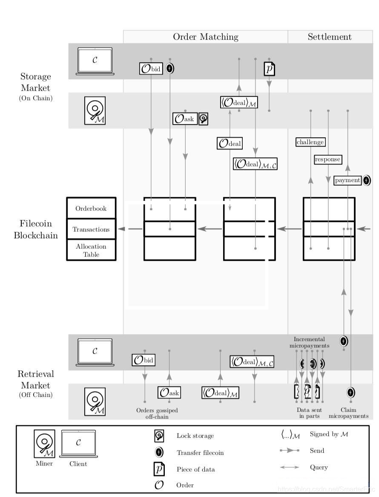
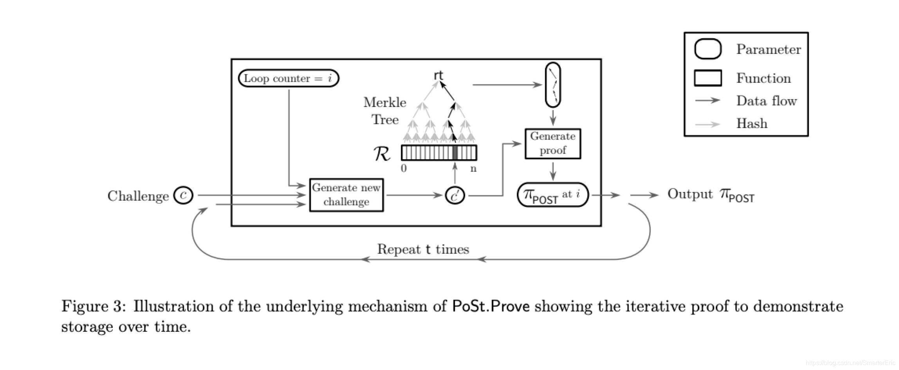
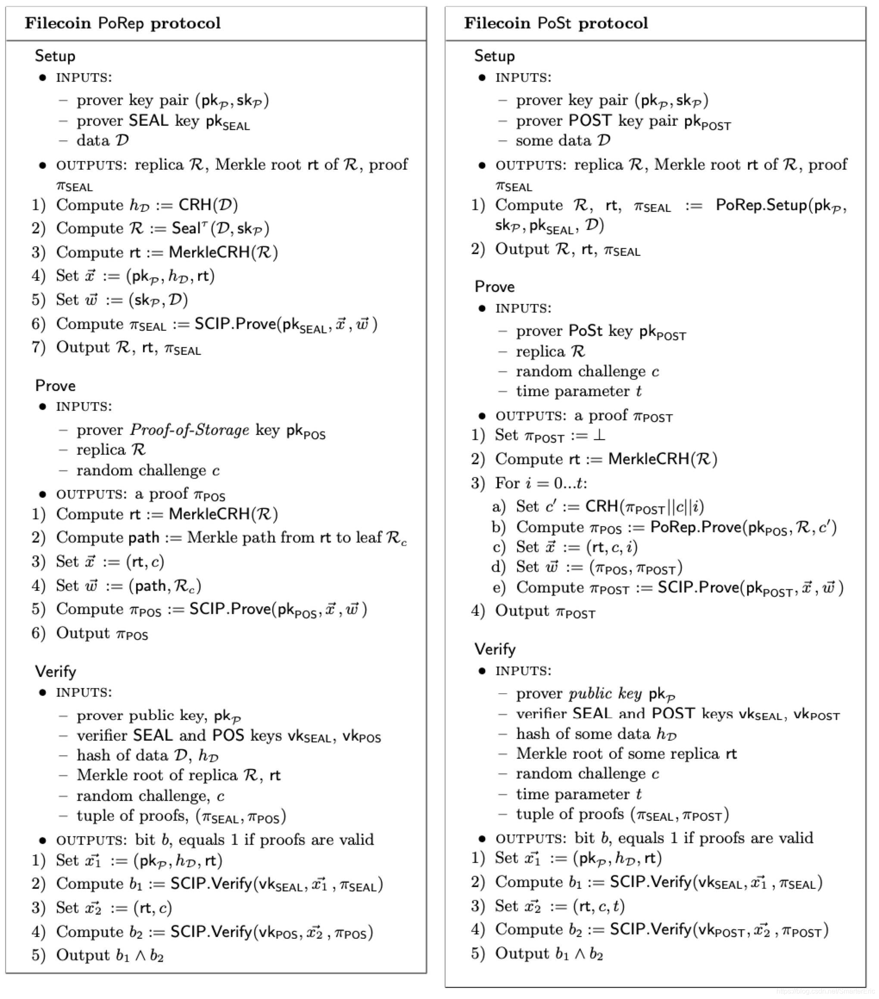
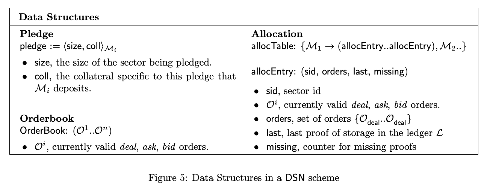

<h1>Filecoin：一种去中心化的存储网络<h1>

出处：[filecoin白皮书英文版](https://filecoin.io/filecoin.pdf)

<!-- TOC -->

- [摘要](#摘要)
- [1. 介绍](#1-介绍)
    - [**1.1 基本组件**](#11-基本组件)
    - [**1.2 协议概述**](#12-协议概述)
    - [**1.3 论文组织**](#13-论文组织)
- [2. 去中心化存储网络的定义](#2-去中心化存储网络的定义)
    - [**2.1 故障容错**](#21-故障容错)
    - [**2.2 属性**](#22-属性)
- [3. 复制证明与时空证明](#3-复制证明与时空证明)
    - [**3.1 动机**](#31-动机)
    - [**3.2 复制证明**](#32-复制证明)
    - [**3.3 时空证明**](#33-时空证明)
    - [**3.4 PoRep和PoSt实际应用**](#34-porep和post实际应用)
    - [**3.5 在Filecoin的应用**](#35-在filecoin的应用)
- [4. Filecoin:DSN构建](#4-filecoindsn构建)
    - [**4.1 环境**](#41-环境)
    - [**4.2 数据结构**](#42-数据结构)
    - [**4.3 协议**](#43-协议)
    - [**4.4 担保和要求**](#44-担保和要求)
- [5. Filecoin的存储和检索市场](#5-filecoin的存储和检索市场)
    - [**5.1 验证市场**](#51-验证市场)
    - [**5.2 存储市场**](#52-存储市场)
    - [**5.3 检索市场**](#53-检索市场)
- [6. 有用工作共识](#6-有用工作共识)
    - [**6.1 动机**](#61-动机)
    - [**6.2 Filecoin 共识**](#62-filecoin-共识)
- [7. 智能合约](#7-智能合约)
    - [**7.1 Filecoin智能合约**](#71-filecoin智能合约)
    - [**7.2 与其他系统的集成**](#72-与其他系统的集成)
- [8. 未来的工作](#8-未来的工作)
    - [**8.1 正在进行的工作**](#81-正在进行的工作)
    - [**8.2 开放式问题**](#82-开放式问题)
    - [**8.3 证明和正式的验证**](#83-证明和正式的验证)

<!-- /TOC -->

白皮书原文：https://filecoin.io/filecoin.pdf

# 摘要 

当前互联网正处于一场革命中：集中式专有服务正在被去中心化开放服务所代替；信任式参与被可验证式计算所代替；脆弱的位置寻址被弹性的内容寻址所代替；低效率的整体式服务被点对点算法市场所代替；比特币、以太坊和其他的区块链网络已经证明了去中心化交易账本的有效性。这些公共账本处理复杂的智能合约应用程序和交易价值数百亿美金的加密资产。这些系统的参与者们形成去中心化的、没有中心管理机构或者可信任党派的网络提供了有用的支付服务，这是广泛互联网开放服务的第一个实例。IPFS通过分散的网页自身已经证明了内容寻址的有效性，它提供了全球点对点网络数十亿文件使用。它解放了孤岛数据，网络分区存活，离线工作，审查制度路线，产生了持久的数字信息。

Filecoin是一个去中心化存储网络，它让云存储变成一个算法市场。这个市场运行在有着本地协议令牌（也叫做Filecoin）的区块链。区块链中的旷工可以通过为客户提供存储来获取Filecoin,相反的，客户可以通过花费Filecoin来雇佣旷工来存储或分发数据。和比特币一样，Filecoin的旷工们为了巨大的奖励而竞争式挖区块，但Filecoin的挖矿效率是与存储活跃度成比例的，这直接为客户提供了有用的服务（不像比特币的挖矿仅是为了维护区块链的共识）。这种方式给旷工们创造了强大的激励，激励他们尽可能多的聚集存储器并且把它们出租给客户们。Filecoin协议将这些聚集的资源编织成世界上任何人都能依赖的自我修复的存储网络。该网络通过复制和分散内容实现鲁棒性，同时自动检测和修复副本失败。客户可以选择复制参数来防范不同的威胁模型。该协议的云存储网络还提供了安全性，因为内容是在客户端端对端加密的，而存储提供者不能访问到解密秘钥。Filecoin的成果作为可以为任何数据提供存储基础架构的IPFS最上面的激励层。它对去中心化数据，构建和运行分布式应用程序，以及实现智能合同都非常有用。

这些工作包括以下几部分内容：

（a）介绍Filecoin网络，概述这个协议以及详细介绍几个组件。

（b）形式化去中心化存储网络（DSN）的计划与内容，然后构建Filecoin作为一个DSN。

（c）介绍一种叫“复制证明”的新型存储证明方案，它允许验证任何数据副本都存储在物理上独立的存储器中。

（d）介绍一种新型的以基于顺序复制和存储作为激励度量的有用工作共识。

（e）形成可验证市场，并构建两个市场，存储市场和检索市场，它们分别管理如何从Filecoin写入和读取数据。

（f）讨论用例，如何连接其他系统以及如何使用这个协议。

注意：Filecoin是一项正在进行的工作。正在进行积极的研究，本文的新版本将会出现在https://filecoin.io

如有意见和建议，请通过research@filecoin.io与我们联系

# 1. 介绍

Filecoin是一种协议令牌，其区块链运行在一种叫“时空证明”的新型证明机制上，其区块被存储数据的矿工所挖。Filecoin协议通过不依赖于单个协调员的独立存储提供商组成的网络提供数据存储服务和数据检索服务。其中：
\1. 用户为数据存储和检索支付令牌
\2. 存储矿工通过提供存储空间赚取令牌
\3. 检索矿工通过提供数据服务赚取令牌

## **1.1 基本组件**

**Filecoin协议由四个新型组件组成**

**1. 去中心化存储网络**(Decentralized Storage Network）(DSN）：我们提供一个由提供存储和检索服务的独立服务商网络的抽象（在第二节）。接着我们提出了Filecoin协议作为激励，可审计和可验证的DSN构建（在第4节）。

**2. 新型的存储证明**：我们提出了两种新型存储证明方案（在第三节）：

（1）“复制证明”（Proof-of-Replication）允许存储提供商证明数据已经被复制到了他自己唯一专用的物理存储设备上了。执行唯一的物理副本使验证者能够检查证明者是否不存在将多个数据副本重复拷贝到同一存储空间。

（2）“时空证明”（Proof-of-Spacetime）允许存储提供商证明在指定的时间内存储了某些数据。

**3. 可验证市场**： 我们将存储请求和检索需求作为两个由Filecoin网络操作的去中心化可验证市场的订单进行建模（在第五节）。验证市场确保了当一个服务被正确提供的时候能执行付款。我们介绍了客户和矿工可以分别提交存储和检索订单的存储市场和检索市场。

**4. 有效的工作量证明**（Proof-of-Work）：我们展示了如何基于“时空证明”来构建有效的工作量证明来应用于共识协议。旷工们不需要花费不必要的计算来挖矿，但相反的必须存储数据于网络中。

## **1.2 协议概述**

• Filecoin协议是构建于区块链和带有原生令牌的去中心化存储网络。客户花费令牌来存储数据和检索数据，而矿工们通过提供存储和检索数据来赚取令牌。

• Filecoin DSN 分别通过两个可验证市场来处理存储请求和检索请求：存储市场和检索市场。客户和矿工设定所要求服务的价格和提供服务的价格，并将其订单提交到市场。

• 市场由Filecoin网络来操作，该网络采用了“时空证明”和“复制证明”来确保矿工们正确存储他们承诺存储的数据。

• 最后，矿工们能参与到区块链新区块的锻造。矿工对下一个区块链的影响与他们在网络中当前存储使用量成正比。
图一是使用了术语定义之后的Filecoin协议草图，伴随着一个例子如图2所示

## **1.3 论文组织**

本文的其余部分安排如下：我们在第二节中介绍了对一个理论上的DNS方案的定义和需求。在第三节中我们定义和介绍我们的“复制证明”和“时空证明”协议，以及Filecoin将其用于加密地验证数据按照订单的要求被持续不断的存储。第四节描述了Filecoin DSN的具体实例，描述了数据结构，协议，以及参与者之间的交互。第5节定义和描述可验证市场的概念，还有存储市场和检索市场的实施。第6节描述了使用“时空证明”协议进行演示，并且评估矿工对网络的贡献，这对扩展区块链块和区块奖励是必要的。第7节简要介绍了Filecoin中的智能合约。在第8节中讨论了未来的工作作为结束。

```png

Filecoin协议的框架：

**网络
在账本L中，每个时期t时:
对每个新区块:
(a) 检查区块的结构是否有效；
(b) 检查所有的交易是否有效；
© 检查所有的订单是否有效；
(d) 检查所有的证明是否有效；
(e) 检查所有的抵押是否有效；
(f) 如果以上条件任意一个不满足，那么丢弃该区块。
在t时间内，对每一个订单O：
(a) 添加订单O到存储市场的订单簿；
(b) 如果O是bid（出价订单）：lock O.funds（上锁该订单的资金）；
© 如果O是ask（询价订单）：lock O.space（上锁订单上提供的存储空间）；
(d) 如果O是deal（成交订单）：run Put.AssignOrders（买卖双方对deal进行签字）
存储市场中订单簿的每一个订单:
(a) 检查订单是否过期 (或者被取消):
1） 将该订单从订单簿中移除；
2） 返还订单中的上锁资金；
3） 从分配表中释放上锁的存储空间。
(b) 如果O是deal，通过运行Manage.RepairOrders检查是否有想要的证明存在:
1） 如果，证明丢失一个，那么会罚没存储矿工抵押品的一部分；
2） 如果证明超过∆fault个，那么取消该订单，并将其重新引入到市场；
3） 如果数据碎片不能被检索和重新组合，那么取消该订单并返还用户抵扣的资金；

**客户
任意时间:
通过Put.AddOrders提交新的存储订单：
(a) 通过Put.MatchOrders寻找匹配的询价订单；
(b) M将要保存的文件发送给已匹配成功的矿工；
通过Get.AddOrders提交一个新的检索订单：
(a) 通过Get.MatchOrders查找到与之匹配的订单；
(b) 创建一个支付矿工M的支付通道。
客户一旦收到来自存储矿工M的成交订单时：
1） 对成交订单进行签名；
2） 通过Put.AddOrders将签名过的成交订单提交到区块链中。

客户一旦收到来自检索矿工M的数据碎片:
1） 确认碎片是否有效，以及是不是自己需求的；
2） 发送一个小型支付给矿工M。

**存储矿工
任意时间:
通过Manage.PledgeSector重新构建一个过期的抵押；
通过Manage.PledgeSector抵押新的存储；
通过Put.AddOrder提交一个新的询价订单。
在每段时间t:

对订单簿中每一个询价订单Oask:
(a) 通过Put.MatchOrders查找匹配的订单；
(b) 与匹配的客户建立联系，并创建一个新的成交订单。
对每一个抵押的扇区:
(a) 通过Manage.ProveSector生成一个存储的证明；
(b) 如果发布证明的时间一到 (每隔∆proof时间), 将证明提交到区块链。
一旦从客户那里获取到数据碎片p:

检查碎片的大小是否与客户出价订单里描述的一致；
创建一个成交订单，签名，并发送给客户；
将碎片存储到扇区中；
如果扇区存储已满，将运行Manage.SealSector

**检索矿工
任意时刻:
在网络中四处广播询价订单；
在网络中监听出价订单。
一旦检索矿工接收到客户的请求:

开启一个与客户C的支付通道；
将检索到的数据分成多份；
当收到支付以后，才发送数据，一份一份的方式发送。

图1: Filecoin 协议草图

```



图2: 凭借对Filecoin协议的直觉，我们脑海中有了客户和矿工交互的概览。存储和检索市场分别显示在图2的上方和下方，时间从左边的订单匹配阶段推进到右边的结算阶段。

注解：在执行检索服务的小型支付之前，客户必须对要支付的资金上锁。


# 2. 去中心化存储网络的定义

我们介绍了去中心化存储网络（DSN）方案的概念。DSNs聚集了由多个独立存储提供商提供的存储，并且能自我协调的提供存储数据和检索数据服务给客户。这种协调是去中心化的、无需信任的：通过协议的协调与个体参与者能实施验证操作，系统可以获得安全性操作。DSNs可以使用不同的协调策略，包括拜占庭协议，gossip协议或者CRDTs，这取决于系统的需求。在后面，第四节，我们提供Filecoin DSN的的一个构建。

**定义 2.1**

DSN方案(Π）是由存储提供商和客户运行的协议元组: (Put, Get, Manage）

• Put(data） → key: 客户端执行Put协议以将数据存储在唯一的标识符秘钥下。

• Get(key） → data: 客户端执行Get协议来检索当前使用秘钥存储的数据。

• Manage(）: 网络的参与者通过管理协议来协调：控制可用的存储，审核提供商提供的服务并修复可能的故障、管理协议由存储提供商来运行，并且经常与客户或者审计网络结合（在管理协议依赖区块链的情况下，我们认为矿工是审计人员，因为他们验证和协调存储提供商）。

DSN方案(Π）必须保证数据的完整性和可恢复性，并且能够容忍在后面章节中所定义的管理和存储故障。

## **2.1 故障容错**

**2.1.1 管理故障**

我们将管理故障定义为管理协议的参与者引起的拜占庭故障。一个DSN方案依赖于它的基础管理协议的故障容错。违反故障容错的管理故障假设可能会影响系统的活跃度和安全性。
例如，考虑一个DSN方案，其中管理协议要求拜占庭容错来审核存储提供商。在这样的协议中，网络收集到来自存储提供商的存储证明，并运行拜占庭容错对这些证明的有效性达成共识。如果在总共n个节点中，拜占庭容错最多容忍f个故障节点。那么我们的DSN可以容忍f < n/2 个故障节点。在违反了这些假设的情况下，审计上就要做出妥协。

**2.1.2 存储故障**

我们将存储故障定位为拜占庭故障，阻止了客户检索数据。例如存储矿工丢失了他们的数据，检索矿工停止了他们的服务。一个成功的Put操作的定义是(f, m）,既是它的输入数据被存储在m个独立的存储提供商（总共有n个）中，并且它可以容忍最多f个拜占庭存储提供商。参数f和m取决于协议的实现。协议设计者可以固定f和m，或者留给用户自己选择。将Put(data） 扩展为Put(data, f, m）。如果有小于f个故障存储提供商，则对存储数据的Get操作是成功的。

例如，考虑一个简单的方案。它的Put协议设计为每个存储提供商存储所有的数据。在这个方案里，m=n,并且f=m-1。但总是f=m-1吗，不一定的，有些方案可能采用可擦除式设计，其中每个存储供应商存储数据的特定部分，这样使得m个存储供应商中的x个需要检索数据，在这种场景下f=m-x。

## **2.2 属性**

我们描述DSN方案所必须的两个属性，然后提出Filecoin DSN所需要的其他属性。

**2.2.1 数据完整性**

该属性要求没有有限的对手A可以让客户在Get操作结束的时候接受被更改或者伪造的数据。

**定义 2.2**

一个DSN方案(Π）提供了数据完整性：如果有任意成功的Put操作将数据d设置在键k下，那不存在计算有限的对手A能使得客户在对键k执行Get操作结束的时候接受d’，其中d' 不等于d。

**2.2.2 可恢复性**

该属性满足了以下要求：考虑到我们的Π的容错假设，如果有些数据已经成功存储在Π并且存储提供商继续遵循协议，那么客户最终能够检索到数据。

**定义2.3**

一个DSN方案(Π）提供了可恢复性：如果有任意成功的Put操作将数据d设置在键k下，且存在一个成功的客户Get操作通过对键K执行检索得到数据（这个定义并不保证每次Get操作都能成功，如果每次Get操作最终都能返回数据，那这个方案是公平的）。

**2.3 其他属性**

DSNs可以提供特定于其应用程序的其他属性。我们定义了Filecoin DSN所需要的三个关键属性：公开可验证性、可审查性和激励兼容性。

**定义2.4**

一个DSN方案(Π）是公开可验证的：对于每个成功的Put操作，存储网络的供应商可以生成数据当前正在被存储的证明。这个存储证明必须说服任何只知道键但并不能访问键所对应的数据的有效验证者。

**定义2.5**

一个DSN方案(Π）是可审查的：如果它产生了可验证的操作轨迹，并且在未来能被检查在正确的时间上数据确实被存储了。

**定义2.6**

一个DSN方案(Π）是激励可兼容的：如果存储提供商由于成功提供了存储数据和检索数据的服务而获得激励，或者因为作弊而得到惩罚。所有存储提供商的优势策略是存储数据。

# 3. 复制证明与时空证明

在Filecoin协议中，存储商必须让他们的客户相信，客户所付费的数据已经被他们存储。在实践中，存储供应商将生成'存储证明'(POS）给区块链网络（或客户自己）来验证。

在本节中，我们介绍和概述在Filecoin中所使用的“复制证明”n (PoRep）和“时空证明”(PoSt）实现方案。

## **3.1 动机**

存储证明(POS）方案类似“数据持有性验证”(PDP）[2]和“可恢复性证明”(PoR）[3,4]方案。它允许一个将数据外包给服务器（既证明人P）的用户（既验证者V）可以反复检查服务器是否依然存储数据D。用户可以用比下载数据还高效的方式来验证他外包给服务器的数据的完整性。服务器通过对一组随机数据块进行采样和提交小量数据来生成拥有的概率证明作为给用户的响应协议。

PDP和PoR方案只保证了证明人在响应的时候拥有某些数据。在Filecoin中，我们需要更强大的保障能阻止作恶矿工利用不提供存储却获得奖励的三种类型攻击：女巫攻击(Sybil attack）、外包攻击(outsourcing attacks）、代攻击？（generation attacks）。

• 女巫攻击：作恶矿工可能通过创建多个女巫身份假装物理存储很多副本（从中获取奖励），但实际上只存储一次。

• 外包攻击：依赖于可以快速从其他存储提供商获取数据，作恶矿工可能承诺能存储比他们实际物理存储容量更大的数据。

• 代攻击：作恶矿工可能宣称要存储大量的数据，相反的他们使用小程序有效地生成请求。如果这个小程序小于所宣称要存储的数据，则作恶矿工在Filecoin获取区块奖励的可能性增加了，因为这是和矿工当前使用量成正比的。

## **3.2 复制证明**

“复制证明”(PoRep）是一个新型的存储证明。它允许服务器（既证明人P）说服用户（既验证者V）一些数据D已被复制到它唯一的专用物理存储上了。我们的方案是一种交互式协议。当证明人P:（a）承诺存储某数据D的n个不同的副本（独立物理副本），然后（b）通过响应协议来说服验证者V，P确实已经存储了每个副本。据我们所知PoRep改善了PDP和PoR方案，阻止了女巫攻击、外包攻击、代攻击。
请注意，正式的定义，它的属性描述，和PoRep的深入研究，我们参考了[5]

**定义3.1**

PoRep方案使得有效的证明人P能说服验证者V，数据D的一个P专用的独立物理副本R已被存储。PoRep协议其特征是多项式时间算法的元组：(Setup, Prove, Verify）

• PoRep.Setup(1λ, D） → R, SP, SV, 其中SP和SV是P和V的特点方案的设置变量，λ是一个安全参数。PoRep.Setup用来生成副本R，并且给予P和V必要的信息来运行PoRep.Prove 和 PoRep.Verify。一些方案可能要求证明人或者是有互动的第三方去运算PoRep.Setup。

• PoRep.Prove(SP, R, c） → πc，其中c是验证人V发出的随机验证，πc是证明人产生的可以访问数据D的特定副本R的证明。PoRep.Prove由P（证明人）为V（验证者）运行生成πc。

• PoRep.Verify(Sv, c, πc） → {0, 1}，用来检测证明是否是正确。PoRep.Verify由V运行和说服V相信P已经存储了R。

## **3.3 时空证明**

存储证明方案允许用户请求检查存储提供商当时是否已经存储了外包数据。我们如何使用PoS方案来证明数据在一段时间内都已经被存储了？这个问题的一个自然的答案是要求用户重复（例如每分钟）对存储提供商发送请求。然而每次交互所需要的通信复杂度会成为类似Filecoin这样的系统的瓶颈，因为存储提供商被要求提交他们的证明到区块链网络。

为了回答这个问题，我们介绍了新的证明，“时空证明”，它可以让验证者检查存储提供商是否在一段时间内存储了他/她的外包数据。这对提供商的直接要求是：

（1）生成顺序的存储证明（在我们的例子里是“复制证明”）来作为确定时间的一种方法。

（2）组成递归执行来生成简单的证明。

**定义3.2**

*（时空证明）Post方案使得有效的证明人P能够说服一个验证者V相信P在一段时间内已经存储了一些数据D。PoSt其特征是多项式时间算法的元组：(Setup, Prove, Verify）

• PoSt.Setup(1λ,D）->Sp，Sv，其中SP和SV是P和V的特点方案的设置变量，λ是一个安全参数。PoSt.Setup用来给予P和V必要的信息来运行PoSt.Prove和PoSt.Prove。一些方案可能要求证明人或者是有互动的第三方去运算PoSt.Setup。

• PoSt.Prove(Sp, D, c, t） → πc，其中c是验证人V发出的随机验证，πc是证明人在一段时间内可以访问数据D的证明。PoSt.Prove由P（证明人）为V（验证者）运行生成πc。

• PoSt.Verify(Sv, c, t, πc） → {0, 1}，用来检测证明是否是正确。PoSt.Verify由V运行和说服V相信P在一段时间内已经存储了R。

## **3.4 PoRep和PoSt实际应用**

我们感兴趣的是PoRep和PoSt的应用构建，可以应用于现存系统并且不依赖于可信任的第三方或者硬件。我们给出了PoRep的一个构建（请参见基于密封的复制证明[5]）,它在Setup过程中需要一个非常慢的顺序计算密封的执行来生成副本。PoRep和PoSt的协议草图在图4给出，Post的底层机制的证明步骤在图3中。

**3.4.1 加密的构建块**

**防碰撞散列** 我们使用一个防碰撞的散列函数：CRH：{0, 1}* → {0, 1}O(λ）。我们还使用了一个防碰撞散列函数MerkleCRH，它将字符串分割成多个部分，构造出二叉树并递归应用CRH，然后输出树根。

**zk-SNARKs** 我们的PoRep和PoSt的实际实现依赖于零知识证明的简洁的非交互式知识论（zk-SNARKs）[6,7,8]。因为zk-SNARKs是简洁的，所以证明很短并且很容易验证。更正式地，让L为NP语言，C为L的决策电路。受信任的一方进行一次设置阶段，产生两个公共密钥：证明密钥pk和验证密钥vk。证明密钥pk使任何（不可信）的证明者都能产生证明证明π，对于她选择的实例x，x∈L。非交互式证明π是零知识和知识证明。任何人都可以使用验证密钥vk验证证明π。特别是zk-SNARK的证明可公开验证：任何人都可以验证π，而不与产生π的证明者进行交互。证明π具有恒定的大小，并且可以在| x |中线性的时间内验证。

可满足电路可靠？的zk-SNARKs是多项式时间算法的元组：(KeyGen, Prove, Verify）

• KeyGen(1λ, C）→ (pk, vk），输入安全参数λ和电路C，KeyGen产生概率样本pk和vk。这两个键作为公共参数发布，可在Lc上用于证明/验证。

• Prove(pk, x, w） → π在输入pk、输入x和NP声明w的见证时，证明人为语句x∈LC输出非交互式证明π。

• Verify(vk, x, π） → {0, 1}当输入vk，输入x和证明 π，验证者验证输出1是否满足x ∈ LC。

我们建议感兴趣的读者参看[6，7，8]对zk-SNARK系统的正式介绍和实现。

通常而言这些系统要求KeyGen是由可信任参与方来运行。创新的可扩展计算完整性和隐私（SCIP）系统[9]展示了在假设信任的前提下，一个有希望的方向来避免这个初始化步骤。

**3.4.2 密封操作**

密封操作的作用是（1）通过要求证明人存储对于他们公钥唯一的数据D的伪随机排列副本成为物理的独立复制，使得提交存储n个副本导致了n个独立的磁盘空间（因此是副本存储大小的n倍）和（2）在PoRep.Setup的时候强制生成副本实质上会花费比预计响应请求更多的时间。有关密封操作的更正式定义，请参见[5]。上述的操作可以用SealτAES−256来实现，并且τ使得SealτAES−256需要花费比诚实的证明验证请求序列多10-100倍的时间。请注意，对τ的选择是重要的，这使得运行SealτBC比证明人随机访问R花费更多时间显得更加明显。

**3.4.3 PoRep构建实践**

这节描述PoRep协议的构建并已在图4包括了一个简单协议草图。实现和优化的细节略过了。

**创建副本** Setup算法通过密封算法生成一个副本并提供证明。证明人生成副本并将输出（不包括R）发送给验证者。

```
Setup
• inputs:
– prover key pair (pkP ,skP ）
– prover SEAL key pkSEAL
– data D
• outputs: replica R, Merkle root rt of R, proof πSEAL
```

**证明存储** Prove算法生成副本的存储证明。证明人收到来自验证者的随机挑战，要求在树根为rt的Merkle树R中确认特定的叶子节点Rc。证明人生成关于从树根rt到叶子Rc的路径的知识证明。

```
Prove
• inputs:
– prover Proof-of-Storage key pkPOS
– replica R
– random challenge c
• outputs: a proof πPOS
```

**验证证明** Verify算法检查所给的源数据的哈希和副本的Merkle树根的存储证明的有效性。证明是公开可验证的：分布式系统的节点维护账本和对特定数据感兴趣的可以验证这些证明。

```
Verify
• inputs:
– prover public key, pkP
– verifier SEAL and POS keys vkSEAL, vkPOS
– hash of data D, hD
– Merkle root of replica R, rt
– random challenge, c
– tuple of proofs, (πSEAL, πPOS）
• outputs: bit b, equals 1 if proofs are valid
```

**3.4.4 PoSt构建实践**

这节描述Post协议的构建并已在图4中包含了一个简单协议草图。实现和优化的细节略过了。

Setup和Verify算法和上面的PoRep构建是一样的。所以我们这里值描述Prove。

**空间和空间的证明** Prove算法为副本生成“时空证明”。证明人接收到来自于验证者的随机挑战，并顺序生成“复制证明”，然后使用证明的输出作为另一个输入做指定t次迭代（见图3）。

```
Prove
• inputs:
– prover PoSt key pkPOST
– replica R
– random challenge c
– time parameter t
• outputs: a proof πPOST
```




##  **3.5 在Filecoin的应用**

Filecoin协议采用”时空证明“来审核矿工提供的存储。为了在Filecoin中使用PoSt，因为没有指定的验证者，并且我们想要任何网络成员都能够验证，所以我们把方案改成了非交互式。因为我们的验证者是在public-coin模型中运行，所以我们可以从区块链中提取随机性来发出挑战。



图4:复制证明和时空证明协议草图。其中CRH为抗碰撞哈希，~x为待证明NP-statement， ~w为见证。

# 4. Filecoin:DSN构建

Filecoin DSN是可升级，可公开验证和激励式设计的去中心化的存储网络。客户为了存储数据和检索数据向矿工网络付费。矿工提供磁盘空间和带宽来赚取费用。矿工只有在网络可以审计他们的服务是否正确提供的时候才会收到付款。

在本节中，我们介绍基于DSN的定义和”时空证明“的Filecoin DSN构建。

##  **4.1 环境**

**4.1.1 参与者**

任何用户都可以作为客户端、存储矿工和/或检索矿工来参与Filecoin网络。

• 客户在DSN中通过Put和Get请求存储数据或者检索数据，并为此付费。

• 存储矿工为网络提供数据存储。存储矿工通过提供他们的磁盘空间和响应Put请求来参与Filecoin。要想成为存储矿工，用户必须用与存储空间成比例的抵押品来抵押。存储矿工通过在特定时间存储数据来响应用户的Put请求。存储矿工生成'时空证明”，并提交到区块链网络来证明他们在特定时间内存储了数据。假如证明无效或丢失，那存储矿工将被罚没他们的部分抵押品。存储矿工也有资格挖取新区块，如果挖到了新块，矿工就能得到挖取新块的奖励和包含在块中的交易费。

• 检索矿工为网络提供数据检索服务。检索矿工通过提供用户Get请求所需要的数据来参与Filecoin。和存储矿工不同，他们不需要抵押，不需要提交存储数据，不需要提供存储证明。存储矿工可以同时也作为检索矿工参与网络。检索矿工可以直接从客户或者从检索市场赚取收益。

**4.1.2 网络 N**

我们将运行所有运行Filecoin全节点的所有用户细化为一个抽象实体：网络。该网络作为运行管理协议的中介。简单的说，Filecoin区块链的每个新块,全节点管理可用的存储，验证抵押品，审核存储证明已经修复可能的故障。

**4.1.3 账本**

我们的协议适用于基于账本的货币。为了通用，我们称之为“账本” L。在任何给定的时间t(称为时期），所有的用户都能访问Lt。当处于时期t的时候，账本是追加式的，它由顺序的一系列交易组成。Filecoin DSN协议可以在运行验证Filecoin的证明的任意账本上实现。在第六节中我们展示了我们如何基于有用的工作构建一个账本。

**4.1.4 市场**

存储需求和供给组成了两个Filecoin市场：存储市场和检索市场。这两个市场是两个去中心化交易所，这会在第5节中详细解释。简而言之，客户和矿工们通过向各自的市场提交订单来设定他们请求服务或者提供服务的订单的价格。交易所为客户和矿工们提供了一种方式来查看匹配出价并执行订单。如果服务请求被成功满足，通过运行管理协议，网络保证了矿工得到报酬，客户将被收取费用。

## **4.2 数据结构**

**碎片** 碎片是客户在DSN所存储数据的一部分。例如，数据是可以任意划分为许多片，并且每片都可以有不同集合的存储矿工来存储。

**扇区** 扇区是存款矿工向网络提供的一些磁盘空间。矿工将客户数据的碎片存储到扇区，并通过他们的服务来赚取令牌。为了存储碎片，矿工们必须向网络抵押他们的扇区。

**分配表** 分配表式衣柜数据结构，可以跟踪碎片和其分配的扇区。分配表在长辈的每个区块都会更新，Merkle根存储在最新的区块中。在实践中，该表用来保持DSN的状态，它使得在证明验证的过程中可以快速查找。更详细的信息，请参看图5。

**订单** 订单式请求或提供服务的意向声明。客户向市场提交投标订单来请求服务（存储数据的存储市场和检索数据的检索市场），矿工们提交报价订单来提供服务。订单数据结构如图10所示。市场协议将在第5节详细介绍。

**订单簿** 订单簿是订单的集合。请查看第5.2.2节的存储市场订单簿和第5.3.3节的检索市场订单簿。

**抵押** 抵押是像网络提供存储（特别是扇区）的承诺。存储矿工必须将抵押提交给账本，以便能在存储市场接受订单。抵押包括了抵押扇区的大小和存储矿工的存放的抵押品。



## **4.3 协议**

在本节中，我们通过描述客户端、矿工和网络执行的操作来概述Filecoin DSN。我们在图7中介绍了Get和Put协议的方法，和在图8中的管理协议。一个协议执行的示例如图6所示。图1是Filecoin协议概览。

**4.3.1 客户生命周期**

我们给出客户生命周期的概览：在第5节接下来的协议会做深度的解析。

1. Put：客户将数据存储于Filecoin

客户可以通过向Filecoin中的矿工支付令牌来存储他们的数据。第5.2节详细介绍了Put协议。
客户通过Put协议向存储市场的订单簿提交投标订单。当找到矿工的匹配报价订单的时候，客户会将数据发给矿工，并且双方签署交易订单将其提交到存储市场订单簿。客户可以通过提交的订单来决定数据的物理副本数量。更高的冗余度会有更高的存储故障容忍度。

2. Get：客户从Filecoin检索数据。客户可以通过使用Filecoin 令牌向存储矿工付费来检索任何数据。Get协议在第5.3节有详细描述。客户端通过执行Get协议向检索市场订单簿提交投标订单。当找到匹配的矿工报价订单后，客户会收到来自矿工的碎片。当收到的时候，双方对交易订单进行签名提交到区块链来确认交易成功。

**4.3.2 挖矿周期（对于存储矿工）**

我们给出一个非正式的挖矿周期概述。

**1. 抵押**

存储矿工通过在抵押交易中存放抵押品来保证向区块链提供存储。通过Manage.PledgeSector，抵押品被抵押一段期限是为了提供服务，如果矿工为他们所承诺提交存储的数据生成存储证明，抵押品就回返还给他们。如果存储证明失败了，一定数量的抵押品就会损失。他们设定价格并向市场订单簿提交报价订单，一旦抵押交易在区块链中出现，矿工就能在存储市场中提供他们的存储。

```
Manage.PledgeSector 
• inputs:
– current allocation table allocTable
– pledge request pledge
• outputs: allocTable'
```

**2. 接收订单** 

存储矿工从存储市场获取存储请求。他们设定价格并通关过Put.AddOrders向市场订单簿提交报价订单，一旦抵押交易出现在区块链中，矿工就能在存储市场中提供他们的存储。

```
Put.AddOrders
• inputs: list of orders O1..On
• outputs: bit b, equals 1 if successful
```

通过Put.MatchOrders 来检查是否和客户的报价订单匹配一致。

```
Put.MatchOrders
• inputs:
– the current Storage Market OrderBook – query order to match Oq
• outputs: matching orders O1..On
```

一定订单匹配，客户会讲他们的数据发给存储矿工。存储矿工接收到数据的时候，运行Put.ReceivePiece 。数据被接收完之后，矿工和客户签收订单并将其提交到区块链。

```
Put.ReceivePiece
• inputs: – signing key for Mj
– current orderbook OrderBook
– ask order Oask
– bid order Obid
– piece p
• outputs: deal order Odeal signed by Ci and Mj
```

**3. 密封：存储矿工为未来的证明准备碎片。**

存储矿工的存储切分为扇区，每个扇区包括了分配给矿工的碎片。网络通过分配表来跟踪每个存储矿工的扇区。当存储矿工的扇区填满了，这个扇区就被密封起来。密封是一种缓慢的顺序操作。将扇区中的数据转换成为副本，然后将数据的唯一物理副本与存储矿工的公钥相关联。在“复制证明”期间密封式必须的操作。如下所述在第3.4节。

```
Manage.SealSector
• inputs:
– miner public/private key pair M
– sector index j
– allocation table allocTable
• outputs: a proof πSEAL, a root hash rt
```

**4. 证明：存储矿工证明他们正在存储所承诺的碎片（数据）。**

当存储矿工分配数据时，必须重复生成复制证明以保证他们正在存储数据（有关更多详细信息，请参看第3节）证明发布在区块链中，并由网络来验证。

```
Manage.ProveSector
• inputs:
– miner public/private key pair M
– sector index j
– challenge c
• outputs: a proof πPOS
```

**4.3.3 挖矿周期（对于检索矿工）**

我们给出一个非正式的挖矿周期概述。

**1. 收到订单：检索矿工从检索市场得到获取数据的请求。**

检索矿工设置价格并向市场订单簿增加报价订单，并通过向网络发送报价单来提供数据。

```
Get.AddOrders
• inputs: list of orders O1..On
• outputs: none
```

然后检索矿工检查是否与客户的报价订单匹配一致。

```
Get.MatchOrders
• inputs:
– the current Retrieval Market OrderBook
– query order to match Oq
• outputs: matching orders O1..On
```

**2. 发送：检索矿工向客户发送数据碎片。**

一旦订单匹配，检索矿工就将数据发送给客户（第5.3节有详细描述）。当数据被接收完成，矿工和客户就签署交易比ing提交到区块链。

```
Put.SendPieces

• inputs: – an ask order Oask
– a bid order Obid
– a piece p
• outputs: a deal order Odeal signed by Mi
```

**4.3.4 网络周期**

我们给出一个非正式的网络操作概述。

**1.分配**：**网络将客户的碎片分配给存储矿工的扇区。**

客户通过向存储市场提交报价订单来启动Put协议。当询价单和报价单匹配的时候，参与的各方共同承诺交易并向市场提交成交的订单。此时，网络将数据分配给矿工，并将其记录到分配表中。

```
Manage.AssignOrders
• inputs:
– deal orders O1deal..Ondeal
– allocation table allocTable
• outputs: updated allocation table allocTable'
```

**2. 修复：网络发现故障并试图进行修复**

所有的存储分配对于网络中的每个参与者都是公开的。对于每个块，网络会检查每个需要的证明都存在，检查它们是否有效，因此采取行动：

```
Manage.RepairOrders
• inputs:
– current time t
– current ledger L
– table of storage allocations allocTable
• outputs: orders to repair O1deal..Ondeal, updated allocation table allocTable
```

o 如果有任何证明的丢失或无效，网络会通过扣除部分抵押品的方式来惩罚存储矿工。

o 如果大量证明丢失或无效（由系统参数Δfault定义），网络会认定存储矿工存在故障，将订单设定为失败，并为同样的数据引入新订单进入市场。

o 如果所有存储该数据的存储矿工都有故障，则该数据丢失，客户获得退款。

## **4.4 担保和要求**

以下是Filecoin DSN如何实现完整性、可检索性，公开可验证性和激励兼容性。

• 实现完整性 数据碎片以加密哈希命名。一个Put请求后，客户只需要存储哈希即可通过Get操作来检索数据，并可以验证收到的数据的完整性。

• 实现可恢复性 在Put请求中，客户指定副本因子和代码期望擦除类型。假设给定的m个存储矿工存储数据，可以容忍最多f个故障，则该方式是(f, m）-tolerant存储。通过在不同的存储提供商存储数据，客户端可以增加恢复的机会，以防存储矿工下线或者消失。

• 实现公开可验证和可审核性 存储矿工需要提交其存储 (πSEAL, πPOST）的证明到区块链。网络中的任意用户都可以在不访问外包数据的情况下验证这些证明的有效性。另外由于这些证明都是存储在区块链上的，所以操作痕迹可以随时审核。

• 实现激励兼容性 不正式的说，矿工通过提供存储而获得奖励。当矿工承诺存储一些数据的时候，它们需要生成证明。如果矿工忽略了证明就回被惩罚（通过损失部分抵押品），并且不会收到存储的奖励。

• 实现保密性 如果客户希望他们的数据被隐私存储，那客户必须在数据提交到网络之前先进行加密。

# 5. Filecoin的存储和检索市场

**Filecoin有两个市场：存储市场和检索市场**。这两个市场有同样的结构但不同的设计。存储市场允许客户为矿工存储数据而付费。检索数据允许客户为矿工提供检索数据传递而付费。在这两种情况下，客户和矿工可以设置报价和需求价格或者接受当前报价。这个交易是由网络来运行的-Filecoin中全节点是拟人化的。网络保证矿工在提供服务时可以得到客户的奖励。

## **5.1 验证市场**

交易市场是促进特定商品和服务交换的协议。它们使得买家和买家促成交易。对于我们而言，我们要求交易是可验证的：去中心化网络的参与者必须能够在买家和卖家间验证交易。我们提出验证市场的概念。它没有单一的实体来管理交易，交易是透明的，任何人都可以匿名参与。可验证市场协议使得服务的交易去中心化：订单簿的一致性，订单结算和服务的正确执行是可以由参与者独立验证的-在Filecoin里面的矿工和全节点。我们简化可验证市场来进行以下构建：

**定义5.1**

可验证市场是一个有两个阶段的协议：订单匹配和结算。订单是购买意图或者出售商品或服务安全性的表述，订单簿就是所有可用订单的列表。

## **5.2 存储市场**

存储市场是可验证的市场，它允许客户（即买家）请求他们的存储数据和存储矿工（即卖家）提供他们的存储空间。

**5.2.1 需求**

我们根据以下需求来设计存储市场协议：

• 链式订单簿 重要的是（1）存储空格的订单式公开的，所以最低价格的订单总是网络知名的，客户可以对订单做出明智的决定（2）客户订单必须始终提交给订单，即使他们接受接受最低的价格，这样市场就可以对新的报价做出反应。因此我们要求订单添加到Filecoin区块链，为的时能被加入订单簿。

• 参与者投入资源：我们要求参与双方承诺他们的资源作为避免损害的一种方式。为了避免存储矿工不提供服务和避免客户没有可用的资金。为了参与存储市场，存储矿工必须保证在DSN中存入与其存储量成比例的抵押品（更多详细信息请参看第4.3.3节）。通过这种方式，网络可以惩罚那些承诺存储数据但又不提供存储证明的存储矿工。同样的，客户必须向订单充入特定数量的资金，以这种方式保证在结算期间的资金可用性。

• 故障自处理 只有在存储矿工反复证明他们已经在约定的时间内存储了数据的情况下，订单才会结算给矿工。网络必须能够验证这些证明的存在性和正确性并且它们是按照规则来处理的。在4.3.4节有修复部分的概述。

**5.2.2 数据结构**

**Put订单** 有三种类型的订单：出价订单，询价订单和交易订单。存储矿工创建询价订单添加存储，客户创建出价订单请求存储，当双方对价格达成一致时，他们共同创建处理订单。订单的数据结构和订单参数的明确定义如图10所示。

**Put订单簿** 存储市场的订单簿是目前有效和开放的询价，出价和 交易订单的集合。用户可以通过Put协议中定义的方法与订单簿进行交互：AddOrders,MatchOrders如图7所示。

订单簿是公开的，并且每个诚实的用户都有同样的订单簿试图。在每个周期，如果新的订单交易出现在新的区块中那它将被添加到订单簿中。如果订单被取消，取消或者结算，则会被删除。订单将被添加到区块链中，因此在订单簿中如果是有效的：

定义5.2 我们定义出价，询价，交易订单的有效性：

（有效出价单） 从客户端发出的投标单Ci,Obid:= (hsize, funds[, price,time, coll, coding]）>Ci,如果满足下面的条件就是有效的：

• Ci 在他们的账户里面至少有可用的资金

• 时间没有超时

• 订单必须保证最少的存储周期（这是个系统参数）

（有效询价单） 从存储矿工发出的询价单Mi，Oask:= (hspace, pricei）Mi，如果满足下面的条件就是有效的：

• Mi承诺为矿工，并且质押期不会在订单周期之前到期

• 空间必须小于Mi的可用存储。Mi在订单中减去承诺的存储（在询价订单和交易订单中）
（有效交易订单） 交易订单Odeal:= (hask, bid,ts）Ci,Mj，如果满足下面的条件就是有效的：

• 询问参考订单Oask，使得：它由Ci签署，且在存储市场的订单簿中没有其他订单涉及它。

• 出价订单参考订单Obid，使得：它由Mj签署，且在存储市场的订单簿中没有其他订单涉及它。

• ts 不能设置为将来时间或者太早的时间

如果作恶客户端从存储矿工出收到了签名的交易，但从来没有将其添加到订单簿，那么存储矿工就无法重新使用订单中提交的存储。这个字段ts就可以防止这种攻击，因为，在超过ts之后，订单变得无效，将无法在订单簿中提交。

**5.2.3 存储市场协议**

简而言之，存储市场协议分为两个阶段：订单匹配和结算：

• 订单匹配：客户端和存储矿工通过提交交易到区块链来将订单提交到订单簿（步骤1）。当订单匹配时，客户端发送数据碎片给存储矿工，双方签署交易并提交到订单簿（步骤2）。

• 结算： 存储矿工密封扇区（步骤3a），生成扇区所包含的碎片的存储证明，并将其定期提交到区块链（步骤3b）；同时，其余的网络必须验证矿工生成的证明并修复可能的故障（步骤3c）。

存储市场协议在图11中详细描述。

##  **5.3 检索市场**

检索市场允许客户端请求检索特定的数据，由检索矿工提供这个服务。与存储矿工不同，检索矿工不要求在特定时间周期内存储数据或者生成存储证明。在网络中的任何用户都可以成为检索矿工，通过提供提供检索服务来赚取Filecoin令牌。检索矿工可以直接从客户端或者检索接收数据碎片，也可以存储它们成为存储矿工。

**5.3.1 需求**

我们根据以下的需求来设计检索市场协议：

• 链下订单簿 客户端必须能够找到提供所需要数据碎片的检索矿工，并且在定价之后直接交换。这意味着订单簿不能通过区块链来运行-因为这将成为快速检索请求的瓶颈。相反的，参与者只能看到订单簿的部分视图。我们要求双方传播自己的订单。

• 无信任方检索 公平交换的不可能性[10]提醒我们双方不可能没有信任方的进行交流。在存储市场中，区块链网络作为去中心化信任方来验证存储矿工提供的存储。在检索市场，检索矿工和客户端在没有网络见证所交换文件的情况下来交换数据。我们通过要求检查矿工将数据分割成多个部分并将每个部分发送给客户端来达到这个目的，矿工们将收到付款。在这种方式中，如果客户端停止付款，或者矿工停止发送数据，任何一方都可以终止这个交易。注意的是，我们必须总是假设总是有一个诚实的检索矿工。

• 支付通道 客户端当提交付款的时候可以立即进行检索感兴趣的碎片。检索矿工只有在确认收到付款的时候才会提供数据碎片。通过公共账本来确认交易可能会成为检索请求的瓶颈，所以，我们必须依靠有效的链下支付。Filecoin区块链必须支持快速的支付通道，只有乐观交易和仅在出现纠纷的情况下才使用区块链。通过这种方式，检索矿工和客户端可以快速发送Filecoin协议所要求的小额支付。未来的工作里包含了创建一个如[11,12]所述的支付通道网络。

**5.3.2 数据结构**

获取订单 检索市场中包含有三种类型的订单：客户端创建的出价单 Obid，检索矿工创建的询价单Oask，和存储矿工和客户端达成的交易订单Odeal。订单的数据结构如图10所示。

获取订单簿 检索市场的订单簿是有效的和公开出价订单，询价订单和交易订单的集合。与存储市场不同，每个用户有不同的订单簿试图，因为订单式在网络中传播的，每个矿工和客户端只会跟踪他们所感兴趣的订单。

**5.3.3 检索市场协议**

简而言之，检索市场协议分为两个阶段：订单匹配和结算：

**订单匹配** 客户端和检索矿工通过广播将订单提交给订单簿（步骤1）。当订单匹配的时候，客户端和检索矿工简历小额支付通道（步骤2）。

**结算** 检索矿工发送小部分的碎片给到客户端，然后对每个碎片客户端会向矿工发送收妥的收据（步骤3）。检索矿工向区块链出示收据从而获得奖励（步骤4）。
该协议在图12中详细解释。

# 6. 有用工作共识

Filecoin DSN协议可以在允许验证的任何共识协议之上实现Filecoin的证明。在本节中，我们将结算如何基于有用来引导共识协议。Filecoin矿工生成“时空证明”来参与共识，而不是浪费的POW。
有用 如果计算的输出对网络来说是有价值的，而不仅仅是为了保证区块链的安全。我们认为矿工在共识协议中所作的工作是有用的。

## **6.1 动机**

**无用的工作** 确保区块链的安全是至关重要的。POW的证明方案往往要求不能重复使用的或者需要大量的浪费计算才能找到难题的解决方案。
不可重复利用的工作 大多数无许可型的区块链要求矿工解决硬计算难题，譬如反转哈希函数。通常情况下这些解决方案都是无用的，除了保护网络安全之外，没有其他任何价值。我们可以重新设计让这件事有用吗？

尝试重复使用的工作：已经有几个尝试重复使用挖矿电路进行有用的计算。有些尝试是要求矿工与标准的POW同时进行一些特殊计算，其他一些尝试用有用问题替代POW的依然难以解决。例如，Primecoin重新使用矿工的计算能力来找到新的素数，以太坊要求矿工与工作证明一起执行小程序，同时证明某些数据正在归档。虽然这些尝试中的大多数都执行有用的工作，但在这些计算中浪费的工作量仍然很普遍的。

**浪费的工作** 解决难题在机器成本和能力消耗方面是非常昂贵的，特别是如果这些难题完全依赖计算能力。当挖矿算法不能并发的时候，那解决难题的普通因素就是计算的功率。我们可以减少浪费的工作吗？

试图减少浪费：理想情况下，大部分网络资源应该花费在有用的工作上。一些尝试是要求矿工使用更节能的解决方案。例如，“空间挖矿”（？Spacemint）要求矿工致力于磁盘空间而不是计算；虽然更加节能，但磁盘空间依然”浪费“，因为它们被随时的数据填满了。其他的尝试是用基于权益证明的传统拜占庭协议来代替难题的解决，其中利益相关方在下一个块的投票与其在系统中所占有的货币份额成正比。
我们着手设计一个基于用户数据存储的有用工作的共识协议。

## **6.2 Filecoin 共识**

**6.2.1 挖矿功率建模**

 在我们的技术报告[13]中，我们提出了功率容错，这是对在参与者对协议结果的影响方面重新构建拜占庭故障的抽象。每个参与者控制了网络总功率n中的一部分功率，其中f是故障节点或作恶节点所控制的功率占比。
Filecoin功率 在Filecoin中，在时刻t，矿工Mi的功率Pt>i是Mi总和的存储任务。Mi的 Iti是网络中Mi总功率的影响因子。

在Filecoin中，算力有以下属性：

• 公开：网络中当前正在使用的存储总量是公开的。通过读取区块链，任何人都可以计算每个矿工的存储任务-因此任何人都可以计算出在任意时间点的每个矿工的功率和总功率。

• 可公开验证的：对于每个存储任务，矿工都需要生成”时空证明“，证明持续提供服务。通过读取区块链，任何人都可以验证矿工的功率声明是否是正确的。

• 变量： 在任意时间点，矿工都可以通过增加新增扇区和扇区补充的抵押来增加新的存储。这样矿工就能变更他们能提供的功率。

**6.2.2 功率会计与时空证明**

每个∆proof 区块（∆proof 是系统参数），矿工们都必须向网络提交“时空证明”，只有网络中大多数功率认为它们是有效的，才会被城管添加到区块链。在每个区块中，每个圈节点会更新分配表（AllocTable），添加新的存储分配、删除过期的和标记缺少证明的记录。可以通过对分配表的记录来对矿工Mi的功率进行计算和验证。这些可以通过两种方式来完成：

• 全节点验证：如果节点拥有完整的区块链记录，则可以从创始块开始运行网络协议直到当前区块，这个过程中验证每一个分配给Mi的“时空证明”。

• 简单存储验证：假设轻客户端可以访问广播最新区块的信任源。请客户端可以从网络中的节点请求

（1）Mi在当前分配表中的记录 

（2）该记录被包含在最新区块的状态树中的Merkle路径

（3）从创世块到当前区块的区块头。这样请客户端就可以将“时空证明”的验证委托给网络。

功率计算的安全性来自于“时空证明”的安全性。在这个设置里面，PoSt保证了矿工无法对他们所分配的存储数量说谎。事实上，他们不能声称能够存储超过他们的存储空间的数据，因为这会花费时间来运行PoSt.Setup，另外PoSt.Prove是串行的计算，并不能并行化的快速生成证明。

**6.2.3 使用功率达成共识**

我们预计通过扩展现在（和未来）的权益证明共识协议来实现Filecoin共识的多种策略，其中权益被替换为分配的存储。我们预计了权益证明协议的改进，我们提出了一个基于我们前期工作，称为预期共识的构建[14]。我们的策略是在每一轮选举一个（或多个）矿工，使得赢得选举的概率与每个矿工分配的存储成比例。
预期共识 预期共识的基本直觉是确定性的，不可预测的。并在每个周期内秘密选举一个小的Leader集合。预期的期望是每个周期内当选的Leader是1，但一些周期内可能有0个或者许多的Leader。Leader们通过创建新区块并广播来扩展区块链网络。在每个周期，每个区块链被延伸一个或多个区块。在某个无Leader的周期内，控区块被添加到区块链中。虽然链中的区块可以线性排序，其数据结构是有向无环图。EC是一个概率共识，每个周期都使得比前面的区块更加确定，最终达到了足够的确定性，且出现不同的历史块链的可能性是足够小的。如果大多数的参与者都通过签署区块链来扩展区块链，加大这个区块所属链的权重，那么这个区块就被确认了。

选举矿工 在每个周期，每个矿工检查他们是否被选为Leader，这类似于完成前面的协议:CoA[15],白皮书[16]，和算法[17]。
译者注：下面的公式表达式请参考英文原版为佳

定义6.1 如果下面的条件是满足的，则在时刻t 矿工Mi 是Leader：

其中rand(t）是在时刻t，可以从区块链中提取出来的公开的随机变量，Pt>i是Mi的功率。考虑对于任意的m，L是H(m）的大小，H是一种安全的加密散列函数，其中（m）Mi是Mi对消息m的签名，使得：

在图13中，我们描述了矿工（ProveElect）和网络节点（VerifyElect）之间的协议。这种选举方案提供了三个属性：公平，保密和公开的可验证性。

• 公平 每个参与者每次选举只有一次试验，因为签名是确定性的，而且t和rand(t）是固定的。假设H是安全的加密散列函数，则H(Mi）/2L必须是从（0，1）均匀选择的实数，因此，可能使得方程等式为true必须是Pti/Σjptj，这等于矿工在在网络中的部分功率。因为这个概率在功率上市线性的，这种可能性在分裂或者汇集功率情况下被保留。注意随机值rand(t）在时刻t之前是未知的。

• 保密 由于有能力的攻击者不拥有Mi用来计算签名的秘钥，考虑到数字签名的假设，这个是可以忽略不计的。

• 公开可验证： 当选Leader i ∈ Lt 可以通过给出t，rand(t），H(i）/2L，来说服一个有效的验证者。鉴于前面的观点，有能力的攻击者在不拥有获胜秘密秘钥的情况下不能生成证明。

# 7. 智能合约

## **7.1 Filecoin智能合约**

智能合约使得Filecoin的用户可以编写有状态的程序，来花费令牌向市场请求存储J/检索数据和验证存储证明。用户可以通过将交易发送到账本触发合约中的功能函数来与智能合约交互。我们扩展了智能合约系统来支持Filecoin的特定操作（如市场操作，证明验证）。

• 文件合约： 我们允许用户对他们提供的存储服务进行条件编程。有几个例子值得一提：

（1）承包矿工：客户可以提前指定矿工提供服务而不参与市场 

（2）付款策略：客户可以为矿工设计不同的奖励策略，例如合约可以给矿工支付随着时间的推移越来高的费用 ，另一个合约可以由值得信任的Oracle的通知来设置存储的价格。

（3）票务服务：合约可以允许矿工存放令牌和用于代表用户的存储/检索的支付 

（4）更复杂的操作：客户可以创建合约来运行数据更新。

• 智能合约：用户可以将程序关联到其他系统（如以太坊[18]）他们的交易上,他们不直接依赖存储的使用。我们预见了以下的应用程序：去中心化命名服务，资产跟踪和预售平台。

## **7.2 与其他系统的集成**

桥是旨在连接不同区块链的工具；现在正在处理中的，我们计划支持跨链交互，以便能将Filecoin存储带入其他基于区块链的平台，同时也将其他平台的功能带入Filecoin。
• Filecoin进入其他平台：其他的区块链系统，如比特币[19]，Zcash [20]，特别是Ethereum [18]和Tezos，允许开发人员写智能合约；然而，这些平台只提供很少的存储能力和非常高的成本。我们计划提供桥将存储和检索支持带入这些平台。我们注意到，IPFS已经被作为几个智能合约（和协议令牌）引用和分发内容的一种方式来使用。增加到Filecoin的支持将允许这些系统以交换Filecoin令牌的方式来保证IPFS存储内容。
• 其他平台进入Filecoin：我们计划提供Filecoin连接其他区块链服务的桥。例如，与Zcash的集成将支持发送隐私数据的存储请求。

# 8. 未来的工作

这项工作为Filecoin网络的建设提供了一个清晰和凝聚的道路;但是，我们也认为这项工作将成为今后研究去中心化存储系统的起点。在这个我们识别和填充三类未来 工作。这包括已经完成只是等待描述和发布的工作，提出改进当前协议的开放式问题，和协议的形式化。

## **8.1 正在进行的工作**

以下主题代表正在进行的工作。

• •每个块中的Filecoin状态树的规范。

• Filecoin及其组件的详细绩效估计和基准。

• 完全可实现的Filecoin协议规范。

• 赞助检索票务模型，其中通过分配每个可持票花费的令牌，任何客户端C1可以赞助另一个客户端C2的下载。

• 分层共识协议，其中Filecoin子网可以在临时或永久分区进行分区并继续处理事务。

• 使用SNARK / STARK增量区块链快照。

• FileCoin-Ethereum合约接口和协议。

• 使用编织（Braid？）进行区块链归档和区块链间冲压。

• 只有在区块链解决冲突的时候才发布'时空证明”。

• 正式证明实现了Filecoin DSN和新型存储证明。

## **8.2 开放式问题**

作为一个整体，有一些公开的问题，其答案有可能可以大大改善网络。尽管事实上，在正式启动之前并不是必须必须解决的问题。

• 一个更好的原始的'复制证明“密封功能，理想情况下是O（n）解码（不是O（nm）），可公开验证，无需SNARK / STARK。

• “复制证明”功能的一个更好的原语，可以公开验证和透明没有SNARK / STARK。

• 一个透明，可公开验证的可检索证明或其他存储证明。

• 在检索市场中进行检索的新策略（例如，基于概率支付，零知识条件支付）。

• “预期共识”更好的秘密Leader选举，在每个周期，只有一位当选Leader。

• 更好的可信赖的SNARK设置方案，允许增加扩展公共参数（可以运行MPC序列的方案，其中每个附加的MPC严格降低故障概率，并且每个MPC的输出可用于系统）。

## **8.3 证明和正式的验证**

由于证明和正式验证的明确价值，我们计划证明Filecoin网络的许多属性，并在未来几个月和几年内开发正式验证的协议规范。几个证明正在进行中还有些正在思考中。但注意，要证明Filecoin的许多属性（如伸缩，离线）将是艰难的，长期的工作。

• 预期共识和变体的正确性证明。

• 功率故障容错正确性的证明，异步1/2不可能导致分叉。

• 在通用组合框架中制定Filecoin DSN，描述Get，Put和Manage作为理想的功能，并证明我们的实现。

• 自动自愈保证的正式模型和证明。

• 正式验证协议描述（例如TLA +或Verdi）。

• 正式验证实现（例如Verdi）。

• Filecoin激励的游戏理论分析。

致谢

这项工作是 Protocol Labs 团队中多个人的累积努力，如果没有实验室的合作者和顾问的帮助、评论和审查这是不可能完成的。 Juan Benet在2014年写了原始的Filecoin白皮书，为这项工作奠定了基础。他和尼古拉·格雷科（Nicola Greco）开发了新的协议，并与提供了有用的贡献，评论，审查意见的团队其他人合作编写了这份白皮书。特别是大卫“大卫”Dalrymple提出了订单范例和其他想法，Matt Zumwalt改进了在这篇论文中的结构，伊万·米亚佐诺（Evan Miyazono）创建了插图，并完成了这篇论文，在设计协议时，Jeromy Johnson提出了深刻的见解，Steven Allen提供了深刻的问题和清晰的说明。我们也感谢所有的合作者和顾问进行有用的对话;尤其是Andrew Miller和Eli Ben-Sasson。

以前版本：QmVcyYg2qLBS2fNhdeaNN1HvdEpLwpitesbsQwneYXwrKV

以太坊打赏地址：0x4FC7d74d493B85c874eF482D7fC572a58513877E

参考文献

[1] Juan Benet. IPFS - Content Addressed, Versioned, P2P File System. 2014.

[2] Giuseppe Ateniese, Randal Burns, Reza Curtmola, Joseph Herring, Lea Kissner, Zachary Peterson, and Dawn Song. Provable data possession at untrusted stores. In Proceedings of the 14th ACM conference on Computer and communications security, pages 598–609. Acm, 2007.

[3] Ari Juels and Burton S Kaliski Jr. Pors: Proofs of retrievability for large files. In Proceedings of the 14th ACM conference on Computer and communications security, pages 584–597. Acm, 2007.

[4] Hovav Shacham and Brent Waters. Compact proofs of retrievability. In International Conference on the Theory and Application of Cryptology and Information Security, pages 90–107. Springer, 2008.

[5] Protocol Labs. Technical Report: Proof-of-Replication. 2017.

[6] Rosario Gennaro, Craig Gentry, Bryan Parno, and Mariana Raykova. Quadratic span programs and succinct nizks without pcps. In Annual International Conference on the Theory and Applications of Cryptographic Techniques, pages 626–645. Springer, 2013.

[7] Nir Bitansky, Alessandro Chiesa, and Yuval Ishai. Succinct non-interactive arguments via linear interactive proofs. Springer, 2013.

[8] Eli Ben-Sasson, Alessandro Chiesa, Daniel Genkin, Eran Tromer, and Madars Virza. Snarks for c: Verifying program executions succinctly and in zero 
knowledge. In Advances in Cryptology–CRYPTO 2013, pages 90–108. Springer, 2013.

[9] Eli Ben-Sasson, Iddo Bentov, Alessandro Chiesa, Ariel Gabizon, Daniel Genkin, Matan Hamilis, Evgenya Pergament, Michael Riabzev, Mark Silberstein, Eran Tromer, et al. Computational integrity with a public random string from quasi-linear pcps. In Annual International Conference on the Theory and Applications of Cryptographic Techniques, pages 551–579. Springer, 2017.

[10] Henning Pagnia and Felix C G¨artner. On the impossibility of fair exchange without a trusted third party. Technical report, Technical Report TUD-BS-1999-02, Darmstadt University of Technology, Department of Computer Science, Darmstadt, Germany, 1999.

[11] Joseph Poon and Thaddeus Dryja. The bitcoin lightning network: Scalable off-chain instant payments. 2015.

[12] Andrew Miller, Iddo Bentov, Ranjit Kumaresan, and Patrick McCorry. Sprites: Payment channels that go faster than lightning. arXiv preprint arXiv:1702.05812, 2017.

[13] Protocol Labs. Technical Report: Power Fault Tolerance. 2017.

[14] Protocol Labs. Technical Report: Expected Consensus. 2017.

[15] Iddo Bentov, Charles Lee, Alex Mizrahi, and Meni Rosenfeld. Proof of activity: Extending bitcoin’s proof of work via proof of stake [extended abstract] y. ACM SIGMETRICS Performance Evaluation Review, 42(3）:34–37, 2014.

[16] Iddo Bentov, Rafael Pass, and Elaine Shi. Snow white: Provably secure proofs of stake. 2016.

[17] Silvio Micali. Algorand: The efficient and democratic ledger. arXiv preprint arXiv:1607.01341, 2016.

[18] Vitalik Buterin. Ethereum , April 2014. URL  https://ethereum.org/

[19] Satoshi Nakamoto. Bitcoin: A peer-to-peer electronic cash system, 2008.

[20] Eli Ben Sasson, Alessandro Chiesa, Christina Garman, Matthew Green, Ian Miers, Eran Tromer, and Madars Virza. Zerocash: Decentralized anonymous payments from bitcoin. In Security and Privacy (SP）, 2014 IEEE Symposium on, pages 459–474. IEEE, 2014.

参考：

[filecoin白皮书英文](https://filecoin.io/filecoin.pdf)

[filecoin白皮书中文](https://blog.csdn.net/SmarterEric/article/details/106521907)

[复制证明和时空证明论文-含密封的定义](https://filecoin.io/proof-of-replication.pdf)