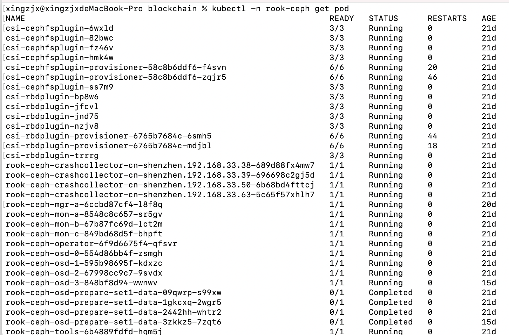
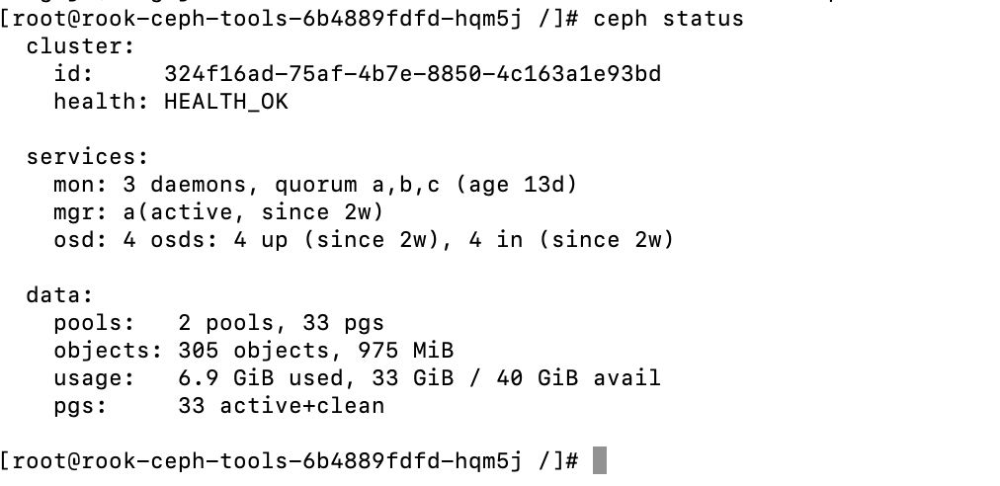
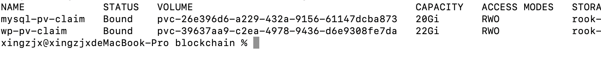

<h1>k8s部署rook ceph 集群<h1/>


<!-- TOC -->

- [环境准备](#环境准备)
- [开始部署](#开始部署)
  - [下载rook源码](#下载rook源码)
  - [执行如下命令](#执行如下命令)
  - [选择集群环境cluster-on-pvc](#选择集群环境cluster-on-pvc)
  - [部署集群](#部署集群)
  - [检查集群状态](#检查集群状态)
- [部署wordpress](#部署wordpress)
  - [创建CephBlockPool和StorageClass](#创建cephblockpool和storageclass)
  - [worldpress使用storegeclass](#worldpress使用storegeclass)
  - [查看存储使用](#查看存储使用)

<!-- /TOC -->

# 环境准备

阿里云k8s集群，可分配的云盘空间。

注意：如果在本地集群搭建ceph集群，需要准备好磁盘空间，在Linux执行命令lsblk查看磁盘分配。

# 开始部署

## 下载rook源码

```zsh
git clone --single-branch --branch v1.6.1 https://github.com/rook/rook.git
```

## 执行如下命令

```
cd rook/cluster/examples/kubernetes/ceph
kubectl create -f crds.yaml -f common.yaml -f operator.yaml
```

## 选择集群环境cluster-on-pvc

找到cluster-on-pvc.yaml，编辑该文件，修改storageClassName字段。

```yaml
volumeClaimTemplate:
      spec:
        storageClassName: alicloud-disk-cloud-retain
        resources:
          requests:
            storage: 10Gi
```

## 部署集群

```
❯ kubectl create -f cluster-on-pvc.yaml
```

Rook文档的重点是在生产环境中启动Rook。还提供了一些部署集群的方式:

cluster.yaml:在裸机上运行的生产集群的集群设置。至少需要三个工作节点。确保有可用的磁盘空间。

cluster-on-pvc.yaml: 用于运行在动态云环境中的生产集群的集群设置。

cluster-test.yaml: 用于minikube等测试环境的集群设置。

部署完成后执行如下命令：

```
❯ kubectl -n rook-ceph get pod
```




## 检查集群状态

安装工具

```
kubectl create -f toolbox.yaml
```

查看工具状态

```
kubectl -n rook-ceph rollout status deploy/rook-ceph-tools
```

进入tools容器

```
kubectl -n rook-ceph exec -it deploy/rook-ceph-tools -- bash
```

执行如下命令

```
ceph status
ceph osd status
ceph df
rados df
```



# 部署wordpress

## 创建CephBlockPool和StorageClass

```
kubectl create -f cluster/examples/kubernetes/ceph/csi/rbd/storageclass.yaml
```

## worldpress使用storegeclass

```
kubectl create -f mysql.yaml
kubectl create -f wordpress.yaml
```

## 查看存储使用

```
kubectl get svc wordpress
```

